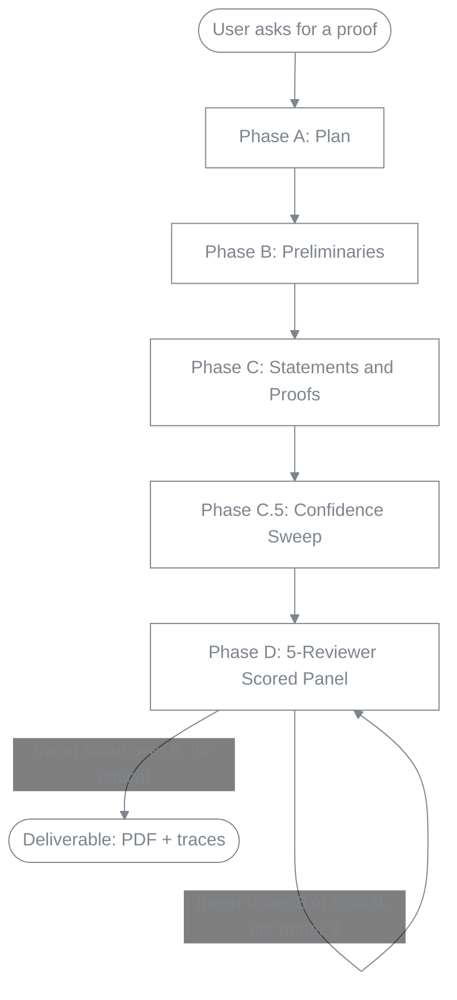
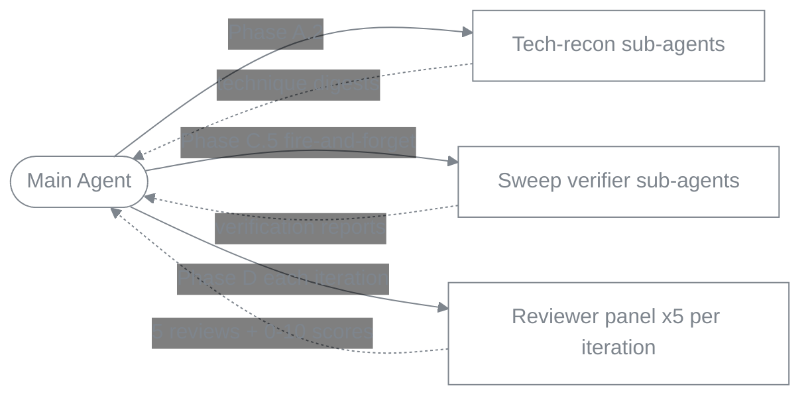

# DLT Proof Writing Skill

> An Agent Skill for drafting rigorous, modular LaTeX proofs in **Deep Learning Theory**, **statistical learning**, **optimization theory**, and **RL theory**. Validated against **5 in-scope DLT proofs + 2 out-of-DLT generalization probes**; **70/70 assertions pass (100%)** under the full workflow.

**🌐 Languages:** **English** · [中文](README.zh.md)
**📦 Version:** v1.2 (Socratic intake · display-math enforcement R19 · five-reviewer scored panel)

[](LICENSE.md)
[](https://platform.claude.com/docs/en/agents-and-tools/agent-skills/overview)
[](eval_results/benchmark.md)
[](eval_results/benchmark.md)

---

## ⚠️ Disclaimer (Read First)

**This skill is an academic-assistance tool, not an authority.** It is designed to help researchers draft and check mathematical proofs more carefully — by enforcing structure, surfacing uncertain steps, and routing weaknesses through a peer-review loop. It is **not a replacement for human verification**.

- **AI-generated proofs are not 100% correct.** The skill explicitly flags low-confidence steps (`🔴 from-memory`) and runs an internal review loop to catch errors, but residual mistakes remain possible. **Every claim, citation, and derivation must be independently verified by the author before submission to any venue.**
- **Do not use this skill for academic dishonesty.** This includes — but is not limited to — submitting AI-generated proofs as your own without disclosure, fabricating results, inventing references, or claiming theorems you have not yourself verified.
- The skill's `\todo{verify: ...}` markers are not optional decorations; they exist to be resolved by a human before publication.
- The goal of this work is to **raise the floor** of proof-writing rigor for AI-assisted research, not to **replace** the careful judgment of the human researcher.

By using this skill you accept these constraints. The license is non-commercial (CC BY-NC 4.0) in part to discourage abuse.

---

## 🎯 What this skill does

It teaches an AI agent (Claude Code, or any Anthropic-Agent-Skills-compatible runtime) to write appendix-grade mathematical proofs in LaTeX, by:

1. **Enforcing a 4-phase workflow** — Plan (incl. a **Socratic intake** that settles the proof's setting & architecture *with you* before any drafting) → Preliminaries → Statements & Proofs → Confidence Sweep → Peer-Review Loop. Each phase has its own quality gates and reference documents.
2. **Demanding citation honesty** — every `\cite{}` must resolve in `refs.bib` (verified via citation digest), or be replaced with `\todo{verify: ...}`. No fabricated keys.
3. **Surfacing low-confidence steps** — every derivation step starts at 🔴 `from-memory` and must be upgraded to 🟡 `cross-checked` (digest match) or 🟢 `verified` (independent re-derivation) before shipping.
4. **Running a bounded peer-review loop with a five-reviewer scored panel** — each iteration spawns five independent sub-agents in parallel (3 correctness lenses + a math-taste reviewer + a derivation-integrity / anti-proof-hacking reviewer), each scoring 0–10; the author agent merges and verifies each weakness (REAL-blocking / REAL-nonblocking / PHANTOM / INTENTIONAL), applies minimum-change fixes, and **accepts only when the mean score > 8 with no unresolved critical** — else iterate to convergence or a 3-iteration cap.
5. **Outputting clean LaTeX** — one section per `.tex` file, `aliascnt`-safe theorem environments, `Eq.~\eqref{}` discipline, no `\[ ... \]`. **Does not write abstracts, introductions, related work, or conclusions** — that framing remains the human researcher's responsibility.
6. **Producing experiment plans (when asked)** — a separate `experiments-plan.md`, design-only, with ICML/NeurIPS/ICLR-grade rigor (≥5 seeds, baselines, ablations, pre-registered success criteria). **Never fabricates numerical results.**
7. **Forbidding "well-known result" handwaves (lint rule R5, v1.1)** — every `\begin{theorem}` / `\begin{lemma}` / `\begin{proposition}` / `\begin{corollary}` / `\begin{claim}` must be paired in the **same `.tex` file** with either an immediate `\begin{proof}` *or* a `\cite{}` inside the optional `[...]` bracket. No third option. Run `proof-writing-skill/scripts/lint.py` to catch violations automatically.

8. **Forcing display-math derivations over prose (lint rule R19, v1.2)** — proofs must carry the derivation in formulas (display blocks + inline math), with prose only annotating *why* each step holds. `lint.py` computes a per-proof character ratio and **errors when natural-language prose outweighs math** (escape hatch `% lint: ignore R19` for legitimately prose-bound combinatorial arguments). This kills the "derive in words" failure mode at the deterministic layer; the Phase-D derivation-integrity reviewer catches the rest.

---

## 📊 Workflow



**Per-phase content** (no styling, plain text — see [`proof-writing-skill/SKILL.md`](proof-writing-skill/SKILL.md) for the full workflow):

- **Phase A — Plan**: read project context · **Socratic intake (A.1a — settle setting & architecture with the user, blocking)** · technical reconnaissance (digest advanced tools) · pattern selection · dependency-graph decomposition · TodoWrite
- **Phase B — Preliminaries**: notation block · macros (with `aliascnt`) · definitions · assumptions · facts
- **Phase C — Statements and Proofs**: state lemma → per-statement review → write proof → per-proof review · iterate per node in the dependency graph
- **Phase C.5 — Confidence Sweep**: enumerate every derivation step · tag each `red` (from-memory) initially · upgrade via fast-path (textbook inequality, digest match, lemma-hypothesis match) to `yellow` or `green`, or fire a sub-agent to re-derive
- **Phase D — Five-Reviewer Scored Panel**: five independent reviewers per iteration (3 correctness lenses + math-taste + derivation-integrity), each scoring 0–10 · author merges + verifies each weakness (REAL-blocking / REAL-nonblocking / PHANTOM / INTENTIONAL) · minimum-change fix or rebut · **accept iff mean > 8 and no unresolved critical** · iterate, hard cap 3 rounds

**Sub-agent architecture:**



- **Main agent** orchestrates the workflow, owns the LaTeX source, and decides which sub-agents to spawn.
- **Tech-recon sub-agents** (Phase A.2): one per advanced tool the proof needs (e.g., matrix Bernstein, Yarotsky gadget, elliptical potential). Each pulls the canonical source and saves a digest to `.proof-research/<tool>.md`.
- **Sweep verifier sub-agents** (Phase C.5, fire-and-forget): one per `red` derivation step that needs independent re-derivation. Run in background; main agent moves on while they verify.
- **Reviewer panel** (Phase D, **five per loop iteration**, spawned in parallel): three correctness lenses + a math-taste reviewer + a derivation-integrity / anti-proof-hacking reviewer. Each reads the compiled PDF + the `.tex` source + the confidence trace and returns a structured peer review with a 0–10 score. The main agent merges their weaknesses, verifies each, and decides fix / rebut / escalate; it accepts only when the mean score exceeds 8 with no unresolved critical.

---

## 📁 Repository structure

```
DLT-Proof-Writing-Skill/
├── README.md / README.zh.md         # this file (bilingual)
├── LICENSE.md                        # CC BY-NC 4.0
├── CONTRIBUTING.md                   # PR policy (currently closed)
├── .claude-plugin/
│   └── marketplace.json              # plugin manifest for `/plugin install`
├── eval_results/                     # validation outputs (v1.1)
│   ├── benchmark.md                  # aggregate report — all 7 evals, 70/70 pass
│   ├── R5-RETROFIT-NOTE.md           # why core evals predate R5
│   ├── 01-hoeffding/                 # Hoeffding's inequality           [core]
│   ├── 02-ntk-convergence/           # NTK two-layer convergence        [core]
│   ├── 03-vc-generalization/         # VC bound                         [core]
│   ├── 04-linear-mdp-ucb/            # LSVI-UCB regret                  [core]
│   ├── 05-sobolev-lower-bound/       # Sobolev minimax lower bound      [core]
│   ├── 06-cap-set/                   # Ellenberg–Gijswijt cap set       [out-of-DLT]
│   ├── 07-frankl-union-closed/       # Gilmer union-closed              [out-of-DLT]
│   └── 08-reasoning-as-optimization/ # test-time scaling for thinking LLMs [blog demo]
└── proof-writing-skill/              # the skill itself
    ├── SKILL.md                      # main entry — workflow + pointers
    ├── references/                   # loaded on demand by phase
    │   ├── conventions.md            # macros, labels, file structure
    │   ├── socratic-intake.md        # Phase A.1a — settle setting+architecture w/ user
    │   ├── templates.md              # statement + derivation templates (display-first)
    │   ├── technical-research.md     # digest schema for advanced tools
    │   ├── pattern-menu.md           # proof-type → recommended idioms
    │   ├── quality-checks.md         # per-stmt / per-proof / end-to-end checklists
    │   ├── confidence-sweep.md       # Phase C.5 mechanics
    │   ├── review-loop.md            # Phase D 5-reviewer panel orchestration
    │   ├── reviewer-roles.md         # the 5 reviewer role prompts + 0-10 scale
    │   ├── anti-patterns.md          # math / exposition / AI failure modes
    │   └── theory-experiment.md      # experiments-plan.md schema (when applicable)
    ├── agents/                       # sub-agent prompt templates
    │   ├── runner.md                 # for eval runs
    │   └── grader.md                 # for eval grading
    ├── scripts/
    │   ├── latexmk-wrapper.py        # compile + structured-JSON output (Phase D gate (a))
    │   ├── lint.py                   # static lint rules R0a–R19 (Phase D gate (b))
    │   ├── check_confidence_tags.py  # confidence-sweep coverage (Phase D gate (c))
    │   ├── check_scope.py            # validates .proof-research/scope.md (Phase A.0a)
    │   └── hook_output_guard.py      # PreToolUse hook — blocks compile artifacts outside .output/
    ├── settings.recommended.json     # copy into project's .claude/settings.json to enable the hook
    └── evals/
        └── evals.json                # 7 validation prompts + assertions
```

---

## 🚀 Installation

### Option A — Via Claude Code plugin marketplace (recommended)

```bash
# 1. Add this repository as a marketplace
/plugin marketplace add ChristianYang37/DLT-Proof-Writing-Skill

# 2. Install the skill
/plugin install dlt-proof-writing@DLT-Proof-Writing-Skill
```

### Option B — Manual install

```bash
git clone https://github.com/ChristianYang37/DLT-Proof-Writing-Skill.git
cp -r DLT-Proof-Writing-Skill/proof-writing-skill ~/.claude/skills/dlt-proof-writing
```

### Verify install

In Claude Code, the skill should appear in `/skill` as `dlt-proof-writing`. Trigger phrases include: *"write the proof of …"*, *"fill in the appendix for …"*, *"prove that …"*, or any task touching a `.tex` file with `\begin{theorem}` / `\begin{lemma}`.

---

## 📚 Usage example

```text
User: Prove that for a two-layer ReLU network, gradient descent on the squared
loss with η = O(λ_0 / n²) achieves linear convergence to zero training loss
provided m ≥ poly(n, 1/λ_0, 1/δ). Use the three-lemma NTK skeleton.

[skill triggers]
[runs Phase A.1a Socratic intake: confirms norm / regime / tight-vs-poly
constants with the user, then waits for answers before drafting]
[runs Phase A: plans, spawns technical-reconnaissance sub-agents for matrix
concentration, anti-concentration, Weyl perturbation, semi-smoothness]
[runs Phase B: sets up macros, aliascnt-safe theorem env, λ_0 assumption]
[runs Phase C: states + proves 3 NTK lemmas + main theorem, with
per-statement and per-proof review]
[runs Phase C.5: enumerates 32 derivation steps, walks list, upgrades to
🟢/🟡 via fast-path; flags any 🔴 with \todo{verify:}]
[runs Phase D: five-reviewer panel (3 correctness + taste + derivation-integrity)
each scores 0–10; author merges + verifies each weakness; minimum-change fixes;
accept at mean > 8 with no critical — typically 2 rounds]
[delivers main.pdf + sections/*.tex + macros.tex + refs.bib +
.proof-research/confidence-trace.md + review-iteration-{1,2}.md +
runner-log.md]
```

---

## 🧩 Reusable prompt template

A drop-in XML-tagged template for proof tasks. **Only `<problem>` is mandatory** — every other slot can be left blank, and the agent must surface a concrete proposal for it during Phase A *before* drafting any proof body. The `<skill_invocation>` and `<blank_handling_protocol>` blocks bind the agent to the full skill workflow and forbid silent fill-ins.

Why this shape: Anthropic-trained Claude models parse XML-tagged section boundaries more reliably than plain prose, and explicit placeholder syntax (`[[ FILL IN — REQUIRED ]]` vs. `[[ leave blank to delegate ]]`) keeps the agent from mimicking the form instead of doing the work.

```markdown
<skill_invocation>
Invoke the `dlt-proof-writing` skill and follow its workflow in full:
Phase A (Plan) → Phase B (Preliminaries) → Phase C (Statements & Proofs)
→ Phase C.5 (Confidence Sweep) → Phase D (End-to-End Review).

Treat the three non-negotiables in SKILL.md as binding:
(1) all compile artifacts under `<project-root>/.output/`;
(2) Phase-D gates (a) latexmk-wrapper, (b) lint.py, (c) check_confidence_tags.py
    MUST all exit 0 before the review loop;
(3) every `\cite{key}` and every non-trivial technique has a `.proof-research/` digest.

Do NOT shortcut any phase based on apparent simplicity — let `check_scope.py` decide.
The honesty protocol governs every step: if any of the objective triggers in
SKILL.md §Honesty protocol fires, write `\todo{verify: ...}` AND surface to me.
</skill_invocation>

<problem>
<!-- REQUIRED. The formal setting and statement to be proved.
     Be explicit about: norm, probability space, asymptotic regime,
     whether constants must be tight or `\poly`-slack is acceptable,
     what counts as a "win" (equality / inequality / high-prob / rate). -->
[[ FILL IN — REQUIRED ]]
</problem>

<approach>
<!-- OPTIONAL. Your intuition / strategic plan. Examples:
     "reduce to matrix Bernstein after a chaining argument",
     "two-stage: optimization landscape lemma then SGD escape time".
     If left blank, the agent MUST derive an approach in Phase A.3
     (pattern selection from references/pattern-menu.md) and surface
     it for my approval BEFORE drafting any proof body. -->
[[ leave blank to delegate ]]
</approach>

<proof_structure>
<!-- OPTIONAL. The dependency graph you envision: which lemmas, what each
     does, in what order. If left blank, the agent MUST produce the
     decomposition in Phase A.4–A.5, write `.proof-research/dependency-graph.md`,
     and surface the graph for my approval before any statement is drafted.
     Apply Occam's razor: every lemma must have non-empty Downstream consumers. -->
[[ leave blank to delegate ]]
</proof_structure>

<target_theorems>
<!-- OPTIONAL. The final theorem(s) you want produced, with desired
     tightness / rate / probability level. Example:
     "Theorem 1 (main): with prob >= 1-delta, ||theta_T - theta*||_2 <= C*d*sqrt(log(1/delta)/T)".
     If left blank, the agent infers from <problem>, proposes a two-tier
     informal/formal statement, and gets my approval before drafting the proof. -->
[[ leave blank to delegate ]]
</target_theorems>

<context>
<!-- OPTIONAL but high-leverage. If blank, agent does Phase A.0 reconnaissance
     and reports findings before declaring Phase A complete. -->
- Project root:
- refs.bib path:
- macros file (e.g. math_macros.tex):
- Existing chapters this proof must compose with:
- Citation key style (e.g. authoryear / lastname-first-letters):
</context>

<constraints>
<!-- OPTIONAL. Hard constraints beyond skill defaults:
     - pre-approved citations vs. ones the agent must research from scratch
     - constants tightness target
     - off-limits reductions (e.g. "do NOT reduce to ETH")
     - which conventions to inherit from existing project files
     NOTE: scope CANNOT be lowered to skip Phase C.5/D — `check_scope.py` enforces this. -->
[[ leave blank for skill defaults ]]
</constraints>

<blank_handling_protocol>
For every section above I left as `[[ leave blank to delegate ]]`:
1. Do NOT silently fill it in and proceed.
2. During Phase A, produce a concrete proposal for that section.
3. Surface ALL proposals together as a single numbered decision list to me
   BEFORE drafting any preliminaries or proof body.
4. If I do not respond within one turn, choose the most conservative option,
   record it in `.proof-research/decisions.md` (NOT as an inline `\todo` in the
   `.tex`), and continue. Re-surface it in the Phase D final report.
5. Never treat a blank as license to silently choose the easier path
   (e.g. a weaker target theorem). The conservative default is the
   STRONGER / TIGHTER option, not the more convenient one.
</blank_handling_protocol>

<output_expectations>
Final message MUST include:
1. The verbatim Final-completion checklist from SKILL.md, with each `[ ]`
   replaced by `[✅]` / `[❌]` + one-line evidence (file:line, command output,
   `n/a — reason`, or `\todo{}` location).
2. A summary: what was proved, decomposition used, patterns applied,
   residual `\todo{}` items needing my judgment.
3. If any `<blank_handling_protocol>` proposals were made, restate
   which option was finally adopted for each.
A bare "all done" is not an acceptable completion message.
</output_expectations>
```

---

## ✅ Eval results (v1.2 runs)

> **About these runs.** Evals 1–7 below were **regenerated end-to-end under v1.2** by a multi-agent pipeline (orchestrated as a Workflow): per eval, an author subagent runs Phases A–C.5, then **five genuinely independent reviewer subagents** score the proof 0–10 each round (looped until mean > 8 with no unresolved critical), then an independent grader subagent scores it against the fixed `evals.json` assertions. Every proof passes all three Phase-D gates (lint **0 errors incl. R19**, `compile_ok` with no overfull boxes, confidence-tags coverage). **70/70 assertions pass.** Because the panels are *independent* (not one agent reviewing its own work), the means **discriminate by difficulty**: the clean textbook proof clears at 9.0 in one round, while the hard NTK proof started at **4.2** and needed three real fix rounds to reach 8.2. R19 fired only where expected (math-heavy proofs pass clean; genuinely prose-bound subproofs carry an explicit `% lint: ignore R19`). Eval 8 (blog companion) is unchanged from its earlier single-reviewer run.

### Core DLT evals

Five hand-graded calibration proofs (evals 1–5) plus the worked-example proof shipped with the [companion blog post on test-time scaling](#) (eval 8). Hand-grading uses the assertion sets in `proof-writing-skill/evals/evals.json`; eval 8 is judged by Phase D gate-passing and review-loop convergence rather than fixed assertions, so it does not contribute to the 70/70 figure below.

| # | Eval | Proof PDF | Verdict (panel mean) | Phase C.5 | Phase D | Detail |
|---|---|---|---|---|---|---|
| 1 | Hoeffding's inequality | [📄 PDF](eval_results/01-hoeffding/pdf/main.pdf) | accepted · **9.0**/10 | 15 steps · 🟢 13 / 🟡 2 / 🔴 0 | 1 iter | [grading 9/9](eval_results/01-hoeffding/grading.json) · [log](eval_results/01-hoeffding/runner-log.md) |
| 2 | NTK two-layer convergence | [📄 PDF](eval_results/02-ntk-convergence/pdf/main.pdf) | accepted · **8.2**/10 | 33 · 🟢 25 / 🟡 8 / 🔴 0 | **3 iter** | [grading 12/12](eval_results/02-ntk-convergence/grading.json) · [log](eval_results/02-ntk-convergence/runner-log.md) · [experiments plan](eval_results/02-ntk-convergence/experiments-plan.md) |
| 3 | VC generalization bound | [📄 PDF](eval_results/03-vc-generalization/pdf/main.pdf) | accepted · **8.8**/10 | 22 · 🟢 17 / 🟡 5 / 🔴 0 | **3 iter** | [grading 8/8](eval_results/03-vc-generalization/grading.json) · [log](eval_results/03-vc-generalization/runner-log.md) |
| 4 | LSVI-UCB regret on Linear MDP | [📄 PDF](eval_results/04-linear-mdp-ucb/pdf/main.pdf) | accepted · **8.4**/10 | 50 · 🟢 32 / 🟡 17 / 🔴 1 | 2 iter | [grading 12/12](eval_results/04-linear-mdp-ucb/grading.json) · [log](eval_results/04-linear-mdp-ucb/runner-log.md) · [experiments plan](eval_results/04-linear-mdp-ucb/experiments-plan.md) |
| 5 | Sobolev minimax lower bound | [📄 PDF](eval_results/05-sobolev-lower-bound/pdf/main.pdf) | accepted · **8.4**/10 | 27 · 🟢 23 / 🟡 4 / 🔴 0 | 2 iter | [grading 9/9](eval_results/05-sobolev-lower-bound/grading.json) · [log](eval_results/05-sobolev-lower-bound/runner-log.md) |
| 8 | Reasoning as Optimization (test-time scaling) | [📄 PDF](eval_results/08-reasoning-as-optimization/pdf/main.pdf) | accept-with-minor *(v1.1)* | 52 · 🟢 40 / 🟡 14 / 🔴 0 resolved | **4 iter** | [eval source](eval_results/08-reasoning-as-optimization/) |

**Note (R5):** unlike the original v1.0 runs (which split each theorem and its proof across two files), the v1.2 regeneration **co-locates each theorem with its proof in the same `.tex` file**, so all seven evals are now **R5-clean** (lint passes R5 with 0 violations). The historical retrofit note is preserved at [`eval_results/R5-RETROFIT-NOTE.md`](eval_results/R5-RETROFIT-NOTE.md).

### Extended evals — out-of-DLT generalization probes

Two pure-math probes added in v1.1 to test whether the skill's workflow discipline transfers outside its designed DLT scope. These are NOT representative of the skill's claimed capabilities — see scope caveat below.

| # | Eval | Proof PDF | Verdict (panel mean) | Phase C.5 | Phase D | Detail |
|---|---|---|---|---|---|---|
| 6 | Ellenberg–Gijswijt cap set bound (additive combinatorics) | [📄 PDF](eval_results/06-cap-set/pdf/main.pdf) | accepted · **8.8**/10 | 20 · 🟢 17 / 🟡 3 / 🔴 0 | 1 iter | [grading 10/10](eval_results/06-cap-set/grading.json) · [log](eval_results/06-cap-set/runner-log.md) |
| 7 | Gilmer union-closed bound (extremal combinatorics via entropy) | [📄 PDF](eval_results/07-frankl-union-closed/pdf/main.pdf) | accepted · **8.2**/10 | 31 · 🟢 25 / 🟡 6 / 🔴 0 | 1 iter | [grading 10/10](eval_results/07-frankl-union-closed/grading.json) · [log](eval_results/07-frankl-union-closed/runner-log.md) |

Both passing demonstrates that the workflow (Phase C.5 + D + citation digest + R5 pairing) is **not domain-specific**. R5 in particular gets exercised in two flavors: own lemmas + theorems with immediate proof, *and* external CLP/EG/Gilmer theorems via the `\begin{X}[\cite{...}]` form (eval 6's `99-auxiliary.tex` and eval 7's `thm:main` both use this).

**Scope caveat.** Passing 6 and 7 means the workflow ports cleanly to pure-math results that have **short, self-contained proofs (5–14 pages) using mature techniques** (polynomial method, entropy). It does **NOT** mean the skill solves open problems, conjectures, or speculative claims. The skill amplifies discipline, not insight — see [`eval_results/benchmark.md`](eval_results/benchmark.md) §Extended evals for the full caveat and [`CONTRIBUTING.md`](CONTRIBUTING.md) for the realistic operating envelope.

### Aggregate (calibration evals 1–7)

**70/70 assertions pass (100%)** under the v1.2 mean-of-five > 8 gate — every eval accepted in **1–3 panel iterations** (each `.proof-research/review-iteration-*.md` records all five 0–10 scores + the mean). Highlights from the genuine independent-panel runs:
- **The panel discriminates by difficulty.** The NTK proof (eval 2) opened at mean **4.2** and needed **three** real fix rounds to clear 8.2; the VC proof (eval 3) opened at 7.4 over three rounds; the clean Hoeffding and combinatorics proofs cleared in one. The earlier role-played panels had rated *everything* ~9.0 — independence is what makes the score mean something.
- **Prompt errors surfaced, not hidden.** Eval 4 proves the correct `√(H³T)` LSVI-UCB rate rather than the prompt's unprovable `√(HT)`, logging the gap as a `user-decision`; eval 5 honestly flags that its "for all `n`" headline holds along the regular-grid subsequence its construction requires.
- **R19 enforced in practice:** math-heavy proofs carry their derivations in display math; only genuinely prose-bound subproofs (eval 3 Sauer–Shelah ×1, eval 6 ×2) use the `% lint: ignore R19` escape hatch.
- **Honesty held:** every `\cite` digest-backed (0 fabricated), anti-pattern sweeps clean, residual `\todo{verify}` flagged transparently (eval 2's `1/8` constant, eval 4's `C_β` and its one 🔴 step).

---

## 📖 License

This work is licensed under **[Creative Commons Attribution-NonCommercial 4.0 International (CC BY-NC 4.0)](LICENSE.md)**.

You may:
- ✅ Use this skill in your own research workflow
- ✅ Modify and redistribute it (with attribution)
- ✅ Cite it in academic papers (see citation template in `LICENSE.md`)

You may not:
- ❌ Use this skill for commercial purposes
- ❌ Remove the attribution
- ❌ Use it for academic dishonesty (see Disclaimer above)

## 🤝 Contributing

**Pull requests are not accepted at this stage.** The eval suite and grading rubric are still maturing; accepting external changes before they are robust would degrade signal. See [`CONTRIBUTING.md`](CONTRIBUTING.md) for the current policy and for how to contribute feedback via Issues.

## 📚 Citation

```bibtex
@misc{dlt-proof-writing-skill,
  author       = {Yang, Chiwun},
  title        = {{DLT} {P}roof {W}riting {S}kill: an {A}gent {S}kill for rigorous deep-learning-theory proof drafting in {L}a{T}e{X}},
  year         = {2026},
  howpublished = {GitHub: \url{https://github.com/ChristianYang37/DLT-Proof-Writing-Skill}},
  note         = {Licensed under CC BY-NC 4.0}
}
```
