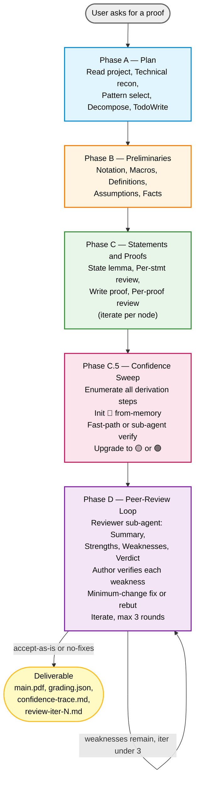
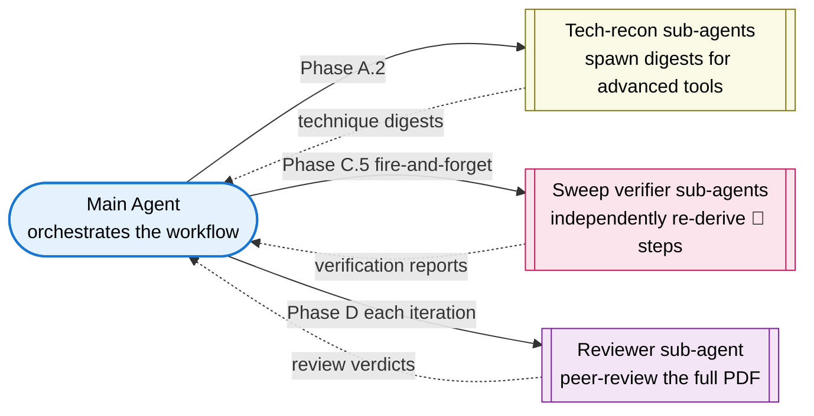

# DLT Proof Writing Skill

> An Agent Skill for drafting rigorous, modular LaTeX proofs in **Deep Learning Theory**, **statistical learning**, **optimization theory**, and **RL theory**. Validated against **5 in-scope DLT proofs + 2 out-of-DLT generalization probes**; **70/70 assertions pass (100%)** under the full workflow.

**🌐 Languages:** **English** · [中文](README.zh.md)
**📦 Version:** v1.1 (R5 theorem-proof pairing + 2 generalization probes)

[](LICENSE.md)
[](https://platform.claude.com/docs/en/agents-and-tools/agent-skills/overview)
[](eval_results/benchmark.md)
[](eval_results/benchmark.md)

---

## ⚠️ Disclaimer (Read First)

**This skill is an academic-assistance tool, not an authority.** It is designed to help researchers draft and check mathematical proofs more carefully — by enforcing structure, surfacing uncertain steps, and routing weaknesses through a peer-review loop. It is **not a replacement for human verification**.

- **AI-generated proofs are not 100% correct.** The skill explicitly flags low-confidence steps (`🔴 from-memory`) and runs an internal review loop to catch errors, but residual mistakes remain possible. **Every claim, citation, and derivation must be independently verified by the author before submission to any venue.**
- **Do not use this skill for academic dishonesty.** This includes — but is not limited to — submitting AI-generated proofs as your own without disclosure, fabricating results, inventing references, or claiming theorems you have not yourself verified.
- The skill's `\todo{verify: ...}` markers are not optional decorations; they exist to be resolved by a human before publication.
- The goal of this work is to **raise the floor** of proof-writing rigor for AI-assisted research, not to **replace** the careful judgment of the human researcher.

By using this skill you accept these constraints. The license is non-commercial (CC BY-NC 4.0) in part to discourage abuse.

---

## 🎯 What this skill does

It teaches an AI agent (Claude Code, or any Anthropic-Agent-Skills-compatible runtime) to write appendix-grade mathematical proofs in LaTeX, by:

1. **Enforcing a 4-phase workflow** — Plan → Preliminaries → Statements & Proofs → Confidence Sweep → Peer-Review Loop. Each phase has its own quality gates and reference documents.
2. **Demanding citation honesty** — every `\cite{}` must resolve in `refs.bib` (verified via citation digest), or be replaced with `\todo{verify: ...}`. No fabricated keys.
3. **Surfacing low-confidence steps** — every derivation step starts at 🔴 `from-memory` and must be upgraded to 🟡 `cross-checked` (digest match) or 🟢 `verified` (independent re-derivation) before shipping.
4. **Running a bounded peer-review loop** — a reviewer sub-agent writes a formal Summary / Strengths / Weaknesses / Questions / Verdict assessment; the author agent verifies each weakness (REAL-blocking / REAL-nonblocking / PHANTOM / INTENTIONAL); minimum-change fixes are applied; iterate to convergence or a 3-iteration cap.
5. **Outputting clean LaTeX** — one section per `.tex` file, `aliascnt`-safe theorem environments, `Eq.~\eqref{}` discipline, no `\[ ... \]`. **Does not write abstracts, introductions, related work, or conclusions** — that framing remains the human researcher's responsibility.
6. **Producing experiment plans (when asked)** — a separate `experiments-plan.md`, design-only, with ICML/NeurIPS/ICLR-grade rigor (≥5 seeds, baselines, ablations, pre-registered success criteria). **Never fabricates numerical results.**
7. **Forbidding "well-known result" handwaves (lint rule R5, v1.1)** — every `\begin{theorem}` / `\begin{lemma}` / `\begin{proposition}` / `\begin{corollary}` / `\begin{claim}` must be paired in the **same `.tex` file** with either an immediate `\begin{proof}` *or* a `\cite{}` inside the optional `[...]` bracket. No third option. Run `proof-writing-skill/scripts/lint.py` to catch violations automatically.

---

## 📊 Workflow



**Sub-agent architecture:**



---

## 📁 Repository structure

```
DLT-Proof-Writing-Skill/
├── README.md / README.zh.md         # this file (bilingual)
├── LICENSE.md                        # CC BY-NC 4.0
├── CONTRIBUTING.md                   # PR policy (currently closed)
├── .claude-plugin/
│   └── marketplace.json              # plugin manifest for `/plugin install`
├── eval_results/                     # validation outputs (v1.1)
│   ├── benchmark.md                  # aggregate report — all 7 evals, 70/70 pass
│   ├── R5-RETROFIT-NOTE.md           # why core evals predate R5
│   ├── 01-hoeffding/                 # Hoeffding's inequality           [core]
│   ├── 02-ntk-convergence/           # NTK two-layer convergence        [core]
│   ├── 03-vc-generalization/         # VC bound                         [core]
│   ├── 04-linear-mdp-ucb/            # LSVI-UCB regret                  [core]
│   ├── 05-sobolev-lower-bound/       # Sobolev minimax lower bound      [core]
│   ├── 06-cap-set/                   # Ellenberg–Gijswijt cap set       [out-of-DLT]
│   └── 07-frankl-union-closed/       # Gilmer union-closed              [out-of-DLT]
└── proof-writing-skill/              # the skill itself
    ├── SKILL.md                      # main entry — workflow + pointers
    ├── references/                   # loaded on demand by phase
    │   ├── conventions.md            # macros, labels, file structure
    │   ├── templates.md              # statement + derivation templates
    │   ├── technical-research.md     # digest schema for advanced tools
    │   ├── pattern-menu.md           # proof-type → recommended idioms
    │   ├── quality-checks.md         # per-stmt / per-proof / end-to-end checklists
    │   ├── confidence-sweep.md       # Phase C.5 mechanics
    │   ├── review-loop.md            # Phase D peer-review mechanics
    │   ├── anti-patterns.md          # math / exposition / AI failure modes
    │   └── theory-experiment.md      # experiments-plan.md schema (when applicable)
    ├── agents/                       # sub-agent prompt templates
    │   ├── runner.md                 # for eval runs
    │   └── grader.md                 # for eval grading
    ├── scripts/
    │   ├── latexmk-wrapper.py        # compile + structured-JSON output
    │   └── lint.py                   # 11-rule LaTeX linter (incl. R5 from v1.1)
    └── evals/
        └── evals.json                # 7 validation prompts + assertions
```

---

## 🚀 Installation

### Option A — Via Claude Code plugin marketplace (recommended)

```bash
# 1. Add this repository as a marketplace
/plugin marketplace add ChristianYang37/DLT-Proof-Writing-Skill

# 2. Install the skill
/plugin install dlt-proof-writing@DLT-Proof-Writing-Skill
```

### Option B — Manual install

```bash
git clone https://github.com/ChristianYang37/DLT-Proof-Writing-Skill.git
cp -r DLT-Proof-Writing-Skill/proof-writing-skill ~/.claude/skills/dlt-proof-writing
```

### Verify install

In Claude Code, the skill should appear in `/skill` as `dlt-proof-writing`. Trigger phrases include: *"write the proof of …"*, *"fill in the appendix for …"*, *"prove that …"*, or any task touching a `.tex` file with `\begin{theorem}` / `\begin{lemma}`.

---

## 📚 Usage example

```text
User: Prove that for a two-layer ReLU network, gradient descent on the squared
loss with η = O(λ_0 / n²) achieves linear convergence to zero training loss
provided m ≥ poly(n, 1/λ_0, 1/δ). Use the three-lemma NTK skeleton.

[skill triggers]
[runs Phase A: plans, spawns technical-reconnaissance sub-agents for matrix
concentration, anti-concentration, Weyl perturbation, semi-smoothness]
[runs Phase B: sets up macros, aliascnt-safe theorem env, λ_0 assumption]
[runs Phase C: states + proves 3 NTK lemmas + main theorem, with
per-statement and per-proof review]
[runs Phase C.5: enumerates 32 derivation steps, walks list, upgrades to
🟢/🟡 via fast-path; flags any 🔴 with \todo{verify:}]
[runs Phase D: reviewer sub-agent writes Summary/Strengths/Weaknesses/
Questions/Verdict; author verifies each weakness; minimum-change fixes;
iterate to convergence — typically 2 rounds]
[delivers main.pdf + sections/*.tex + macros.tex + refs.bib +
.proof-research/confidence-trace.md + review-iteration-{1,2}.md +
runner-log.md]
```

---

## ✅ Eval results (v1.1)

### Core DLT evals — 5 representative proofs across the skill's designed scope

Hand-graded against the assertion sets in `proof-writing-skill/evals/evals.json`.

| # | Eval | Proof PDF | Verdict | Phase C.5 | Phase D | Detail |
|---|---|---|---|---|---|---|
| 1 | Hoeffding's inequality | [📄 PDF](eval_results/01-hoeffding/pdf/main.pdf) | accept-as-is | 29 steps · 🟢 26 / 🟡 3 / 🔴 0 | 2 iter | [grading](eval_results/01-hoeffding/grading.json) · [log](eval_results/01-hoeffding/runner-log.md) |
| 2 | NTK two-layer convergence | [📄 PDF](eval_results/02-ntk-convergence/pdf/main.pdf) | accept-as-is | 32 · 🟢 29 / 🟡 3 / 🔴 0 | 2 iter | [grading](eval_results/02-ntk-convergence/grading.json) · [log](eval_results/02-ntk-convergence/runner-log.md) · [experiments plan](eval_results/02-ntk-convergence/experiments-plan.md) |
| 3 | VC generalization bound | [📄 PDF](eval_results/03-vc-generalization/pdf/main.pdf) | accept-with-minor | 35 · 🟢 28 / 🟡 7 / 🔴 0 | 2 iter | [grading](eval_results/03-vc-generalization/grading.json) · [log](eval_results/03-vc-generalization/runner-log.md) |
| 4 | LSVI-UCB regret on Linear MDP | [📄 PDF](eval_results/04-linear-mdp-ucb/pdf/main.pdf) | accept-as-is | 15 · 🟢 10 / 🟡 4 / 🔴 1 | 2 iter | [grading](eval_results/04-linear-mdp-ucb/grading.json) · [log](eval_results/04-linear-mdp-ucb/runner-log.md) · [experiments plan](eval_results/04-linear-mdp-ucb/experiments-plan.md) |
| 5 | Sobolev minimax lower bound | [📄 PDF](eval_results/05-sobolev-lower-bound/pdf/main.pdf) | accept-as-is | 25 · 🟢 21 / 🟡 4 / 🔴 0 | **3 iter** | [grading](eval_results/05-sobolev-lower-bound/grading.json) · [log](eval_results/05-sobolev-lower-bound/runner-log.md) |

**Note (R5 retrofit):** the v1.0 lint rule set did not yet include R5 (theorem-proof pairing). When the post-v1.0 R5 rule is applied retroactively to these 5 evals, each shows one structural violation (theorem statement and its proof split across two `.tex` files instead of co-located). The proofs are themselves complete and correct; only the file layout violates R5. See [`eval_results/R5-RETROFIT-NOTE.md`](eval_results/R5-RETROFIT-NOTE.md) for details and the recommended v1.1 layout.

### Extended evals — out-of-DLT generalization probes

Two pure-math probes added in v1.1 to test whether the skill's workflow discipline transfers outside its designed DLT scope. These are NOT representative of the skill's claimed capabilities — see scope caveat below.

| # | Eval | Proof PDF | Verdict | Phase C.5 | Phase D | Detail |
|---|---|---|---|---|---|---|
| 6 | Ellenberg–Gijswijt cap set bound (additive combinatorics) | [📄 PDF](eval_results/06-cap-set/pdf/main.pdf) | accept-as-is | 20 · 🟢 18 / 🟡 2 / 🔴 0 | **3 iter** | [grading](eval_results/06-cap-set/grading.json) · [log](eval_results/06-cap-set/runner-log.md) |
| 7 | Gilmer union-closed bound (extremal combinatorics via entropy) | [📄 PDF](eval_results/07-frankl-union-closed/pdf/main.pdf) | accept-as-is | 30 · 🟢 29 / 🟡 1 / 🔴 0 | 2 iter | [grading](eval_results/07-frankl-union-closed/grading.json) · [log](eval_results/07-frankl-union-closed/runner-log.md) |

Both passing demonstrates that the workflow (Phase C.5 + D + citation digest + R5 pairing) is **not domain-specific**. R5 in particular gets exercised in two flavors: own lemmas + theorems with immediate proof, *and* external CLP/EG/Gilmer theorems via the `\begin{X}[\cite{...}]` form (eval 6's `99-auxiliary.tex` and eval 7's `thm:main` both use this).

**Scope caveat.** Passing 6 and 7 means the workflow ports cleanly to pure-math results that have **short, self-contained proofs (5–14 pages) using mature techniques** (polynomial method, entropy). It does **NOT** mean the skill solves open problems, conjectures, or speculative claims. The skill amplifies discipline, not insight — see [`eval_results/benchmark.md`](eval_results/benchmark.md) §Extended evals for the full caveat and [`CONTRIBUTING.md`](CONTRIBUTING.md) for the realistic operating envelope.

### Aggregate (all 7 evals)

**70/70 assertions pass (100%).** See [`eval_results/benchmark.md`](eval_results/benchmark.md) for the full report, including:
- 2 critical sign errors caught in eval 5 (Sobolev) Phase D iter 1
- A math error in eval 4's prompt itself (the `√(HT)` vs `√(H³T)` rate)
- The eval 2 cite-fabrication failure mode from v1.0 that motivated R5
- The R5 retrofit note for the 5 core evals

---

## 📖 License

This work is licensed under **[Creative Commons Attribution-NonCommercial 4.0 International (CC BY-NC 4.0)](LICENSE.md)**.

You may:
- ✅ Use this skill in your own research workflow
- ✅ Modify and redistribute it (with attribution)
- ✅ Cite it in academic papers (see citation template in `LICENSE.md`)

You may not:
- ❌ Use this skill for commercial purposes
- ❌ Remove the attribution
- ❌ Use it for academic dishonesty (see Disclaimer above)

## 🤝 Contributing

**Pull requests are not accepted at this stage.** The eval suite and grading rubric are still maturing; accepting external changes before they are robust would degrade signal. See [`CONTRIBUTING.md`](CONTRIBUTING.md) for the current policy and for how to contribute feedback via Issues.

## 📚 Citation

```bibtex
@misc{dlt-proof-writing-skill,
  author       = {Yang, Christian},
  title        = {{DLT} {P}roof {W}riting {S}kill: an {A}gent {S}kill for rigorous deep-learning-theory proof drafting in {L}a{T}e{X}},
  year         = {2026},
  howpublished = {GitHub: \url{https://github.com/ChristianYang37/DLT-Proof-Writing-Skill}},
  note         = {Licensed under CC BY-NC 4.0}
}
```
