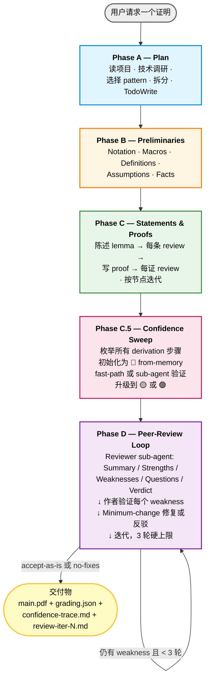
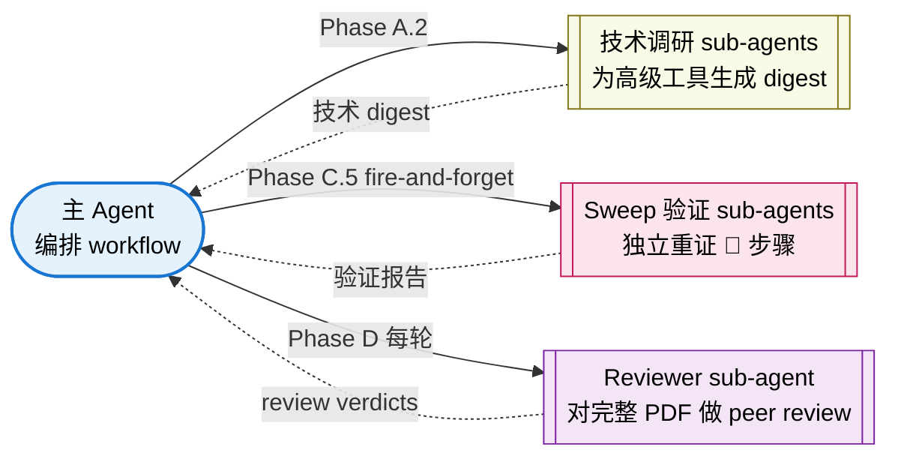

# DLT 证明写作 Skill

> 用于在 **深度学习理论 (Deep Learning Theory)**、**统计学习**、**优化理论**、**强化学习理论** 领域起草严谨、模块化 LaTeX 证明的 Agent Skill。完整 workflow 下 5 个代表性证明全部通过验证（50/50 assertion 100% pass）。

**🌐 语言：** [English](README.md) · **中文**

[](LICENSE.md)
[](https://platform.claude.com/docs/en/agents-and-tools/agent-skills/overview)
[](eval_results/benchmark.md)

---

## ⚠️ 免责声明（请先阅读）

**这是一个学术辅助工具，不是权威。** 它的设计目标是帮助研究者**更谨慎地**起草和检查数学证明——通过强制结构、暴露不确定步骤、把弱点送进 peer-review 循环。它**不能替代人工验证**。

- **AI 生成的证明并非 100% 正确。** Skill 会显式标记低置信度步骤（`🔴 from-memory`）并跑内部 review loop 抓错误，但残余错误仍可能存在。**任何 claim、引用、derivation 在投稿前都必须由作者独立验证。**
- **不可用于学术造假。** 包括但不限于：把 AI 生成证明作为本人成果不加披露地提交、伪造结果、虚构引用、声明从未亲自验证过的定理等。
- Skill 的 `\todo{verify: ...}` 标记不是装饰——它们就是为了**让人来解决**而存在的。
- 本项目的目标是为 AI 辅助科研**抬高证明严谨度的下限**，而不是**取代**人类研究者的判断。

使用本 skill 即视为接受上述约束。License 选择非商用（CC BY-NC 4.0）部分原因正是抑制滥用。

---

## 🎯 这个 Skill 干什么

它教 AI agent（Claude Code 或任何兼容 Anthropic Agent Skills 的 runtime）写 appendix 级别的 LaTeX 数学证明，方式是：

1. **强制四阶段 workflow** —— Plan → Preliminaries → Statements & Proofs → Confidence Sweep → Peer-Review Loop。每个阶段都有自己的质量门和参考文档。
2. **强制引用诚实性** —— 每个 `\cite{}` 必须在 `refs.bib` 中可解析（通过 citation digest 验证），否则替换为 `\todo{verify: ...}`。**禁止编造 key**。
3. **暴露低置信度步骤** —— 每一条 derivation 步骤初始化为 🔴 `from-memory`，必须升级为 🟡 `cross-checked`（digest 匹配）或 🟢 `verified`（独立重证）后才能交付。
4. **跑有界 peer-review 循环** —— reviewer sub-agent 写形式化的 Summary / Strengths / Weaknesses / Questions / Verdict 评审；作者 agent 对每条 weakness 做四分类验证（REAL-blocking / REAL-nonblocking / PHANTOM / INTENTIONAL）；按最小修改原则 fix；迭代到 accept-as-is 或 3 轮硬上限。
5. **输出干净的 LaTeX** —— 一节一个 `.tex` 文件、`aliascnt`-safe 定理环境、`Eq.~\eqref{}` 约定、不用 `\[ ... \]`。**不写 abstract / introduction / related work / conclusion**——那是作者的 framing 工作，不归 skill 管。
6. **按需产出实验方案** —— 如果 prompt 明确要求，会生成单独的 `experiments-plan.md`（**只设计、不编造结果**），达到 ICML / NeurIPS / ICLR 实验门槛（≥5 seeds、baselines、ablations、pre-registered 成功标准）。**Results 节强制留空**。

---

## 📊 工作流图



**Sub-agent 架构：**



---

## 📁 仓库结构

```
DLT-Proof-Writing-Skill/
├── README.md / README.zh.md         # 本文档（双语）
├── LICENSE.md                        # CC BY-NC 4.0
├── CONTRIBUTING.md                   # PR 政策（当前关闭）
├── .claude-plugin/
│   └── marketplace.json              # `/plugin install` 用的 plugin manifest
├── eval_results/                     # 验证产出
│   ├── benchmark.md                  # 总报告
│   ├── 01-hoeffding/                 # Hoeffding 不等式
│   ├── 02-ntk-convergence/           # NTK 两层网络收敛
│   ├── 03-vc-generalization/         # VC 泛化界
│   ├── 04-linear-mdp-ucb/            # LSVI-UCB regret
│   └── 05-sobolev-lower-bound/       # Sobolev minimax 下界
└── proof-writing-skill/              # skill 本体
    ├── SKILL.md                      # 主入口——workflow + pointer
    ├── references/                   # 按 phase 按需加载
    │   ├── conventions.md            # macros / labels / 文件结构
    │   ├── templates.md              # 陈述 + derivation 模板
    │   ├── technical-research.md     # 高级工具 digest schema
    │   ├── pattern-menu.md           # 证明类型 → 推荐 idiom
    │   ├── quality-checks.md         # 每条 / 每证 / 端到端 checklist
    │   ├── confidence-sweep.md       # Phase C.5 机制
    │   ├── review-loop.md            # Phase D peer-review 机制
    │   ├── anti-patterns.md          # 数学 / exposition / AI 失败模式
    │   └── theory-experiment.md      # experiments-plan.md schema
    ├── agents/                       # sub-agent prompt 模板
    │   ├── runner.md                 # eval 跑测
    │   └── grader.md                 # eval 打分
    ├── scripts/
    │   ├── latexmk-wrapper.py        # 编译 + 结构化 JSON 输出
    │   └── lint.py                   # 10 条规则 LaTeX linter
    └── evals/
        └── evals.json                # 5 条验证 prompt + assertions
```

---

## 🚀 安装

### 方案 A —— 通过 Claude Code plugin marketplace（推荐）

```bash
# 1. 把本仓库添加为 marketplace
/plugin marketplace add ChristianYang37/DLT-Proof-Writing-Skill

# 2. 安装 skill
/plugin install dlt-proof-writing@DLT-Proof-Writing-Skill
```

### 方案 B —— 手动安装

```bash
git clone https://github.com/ChristianYang37/DLT-Proof-Writing-Skill.git
cp -r DLT-Proof-Writing-Skill/proof-writing-skill ~/.claude/skills/dlt-proof-writing
```

### 验证安装

在 Claude Code 里 `/skill` 应能看到 `dlt-proof-writing`。触发短语包括：*"write the proof of …"*、*"fill in the appendix for …"*、*"prove that …"*，或任何涉及 `.tex` 文件 + `\begin{theorem}` / `\begin{lemma}` 的任务。

---

## 📚 用法示例

```text
用户：证明两层 ReLU 网络在 η = O(λ_0/n²) 步长下，
对平方损失做梯度下降可以线性收敛到零训练误差，
前提是 m ≥ poly(n, 1/λ_0, 1/δ)。
用三引理 NTK skeleton。

[skill 触发]
[跑 Phase A：规划，为 matrix concentration / anti-concentration /
Weyl perturbation / semi-smoothness 启动技术调研 sub-agents]
[跑 Phase B：搭 macros、aliascnt-safe 定理环境、λ_0 假设]
[跑 Phase C：陈述 + 证明 3 条 NTK 引理 + 主定理，每条 + 每证都走 review]
[跑 Phase C.5：枚举 32 步 derivation，遍历升级为 🟢/🟡；
对 🔴 步留 \todo{verify:}]
[跑 Phase D：reviewer sub-agent 写 Summary/Strengths/Weaknesses/
Questions/Verdict；作者验证每条 weakness；minimum-change 修复；
通常 2 轮收敛]
[交付 main.pdf + sections/*.tex + macros.tex + refs.bib +
.proof-research/confidence-trace.md + review-iteration-{1,2}.md +
runner-log.md]
```

---

## ✅ 验证结果（v1.0）

5 个代表性证明覆盖本 skill 主要 proof 类型。按 `proof-writing-skill/evals/evals.json` 的 assertion 集合人工打分。

| # | Eval | 证明 PDF | Verdict | Phase C.5 | Phase D | 详情 |
|---|---|---|---|---|---|---|
| 1 | Hoeffding 不等式 | [📄 PDF](eval_results/01-hoeffding/pdf/main.pdf) | accept-as-is | 29 steps · 🟢 26 / 🟡 3 / 🔴 0 | 2 iter | [grading](eval_results/01-hoeffding/grading.json) · [log](eval_results/01-hoeffding/runner-log.md) |
| 2 | NTK 两层网络收敛 | [📄 PDF](eval_results/02-ntk-convergence/pdf/main.pdf) | accept-as-is | 32 · 🟢 29 / 🟡 3 / 🔴 0 | 2 iter | [grading](eval_results/02-ntk-convergence/grading.json) · [log](eval_results/02-ntk-convergence/runner-log.md) · [实验方案](eval_results/02-ntk-convergence/experiments-plan.md) |
| 3 | VC 泛化界 | [📄 PDF](eval_results/03-vc-generalization/pdf/main.pdf) | accept-with-minor | 35 · 🟢 28 / 🟡 7 / 🔴 0 | 2 iter | [grading](eval_results/03-vc-generalization/grading.json) · [log](eval_results/03-vc-generalization/runner-log.md) |
| 4 | LSVI-UCB regret (Linear MDP) | [📄 PDF](eval_results/04-linear-mdp-ucb/pdf/main.pdf) | accept-as-is | 15 · 🟢 10 / 🟡 4 / 🔴 1 | 2 iter | [grading](eval_results/04-linear-mdp-ucb/grading.json) · [log](eval_results/04-linear-mdp-ucb/runner-log.md) · [实验方案](eval_results/04-linear-mdp-ucb/experiments-plan.md) |
| 5 | Sobolev minimax 下界 | [📄 PDF](eval_results/05-sobolev-lower-bound/pdf/main.pdf) | accept-as-is | 25 · 🟢 21 / 🟡 4 / 🔴 0 | **3 iter** | [grading](eval_results/05-sobolev-lower-bound/grading.json) · [log](eval_results/05-sobolev-lower-bound/runner-log.md) |

### 扩展验证 —— out-of-DLT 泛化探针 (v1.1)

v1.0 后新增 2 个纯数学探针，测试 skill 的 workflow 是否能迁移到 DLT 之外：

| # | Eval | 证明 PDF | Verdict | Phase C.5 | Phase D | 详情 |
|---|---|---|---|---|---|---|
| 6 | Ellenberg–Gijswijt cap-set 上界 | [📄 PDF](eval_results/06-cap-set/pdf/main.pdf) | accept-as-is | 20 · 🟢 18 / 🟡 2 / 🔴 0 | **3 iter** | [grading](eval_results/06-cap-set/grading.json) · [log](eval_results/06-cap-set/runner-log.md) |
| 7 | Gilmer union-closed 下界 | [📄 PDF](eval_results/07-frankl-union-closed/pdf/main.pdf) | accept-as-is | 30 · 🟢 29 / 🟡 1 / 🔴 0 | 2 iter | [grading](eval_results/07-frankl-union-closed/grading.json) · [log](eval_results/07-frankl-union-closed/runner-log.md) |

两个都通过，说明 workflow 纪律（Phase C.5 + D + citation digest + R5 pairing）**不限定于** DLT。**但 skill 不声明为通用数学证明工具**——scope 注意事项见 `eval_results/benchmark.md` §Extended evals。

**全部 7 evals 合计：** 70/70 assertions pass (100%)。完整报告见 [`eval_results/benchmark.md`](eval_results/benchmark.md)，里面记录了 Phase D loop 实际抓到的错误（eval 5 抓到 2 个 critical sign errors、eval 4 抓到 prompt 本身的数学错误等）。

---

## 📖 License

本作品采用 **[CC BY-NC 4.0 — 知识共享署名-非商业性使用 4.0 国际许可协议](LICENSE.md)**。

你可以：
- ✅ 在自己的研究 workflow 中使用本 skill
- ✅ 修改和再分发（需署名）
- ✅ 在学术论文中引用（cite 模板见 `LICENSE.md`）

你不可以：
- ❌ 用于商业目的
- ❌ 移除署名
- ❌ 用于学术造假（参考前述免责声明）

## 🤝 贡献

**当前不接受 PR**。Eval 套件和打分 rubric 仍在完善，接受外部修改会降低信号质量。详见 [`CONTRIBUTING.md`](CONTRIBUTING.md)——里面说明了现行政策以及如何通过 Issue 提供反馈。

## 📚 引用

```bibtex
@misc{dlt-proof-writing-skill,
  author       = {Yang, Christian},
  title        = {{DLT} {P}roof {W}riting {S}kill: an {A}gent {S}kill for rigorous deep-learning-theory proof drafting in {L}a{T}e{X}},
  year         = {2026},
  howpublished = {GitHub: \url{https://github.com/ChristianYang37/DLT-Proof-Writing-Skill}},
  note         = {Licensed under CC BY-NC 4.0}
}
```
