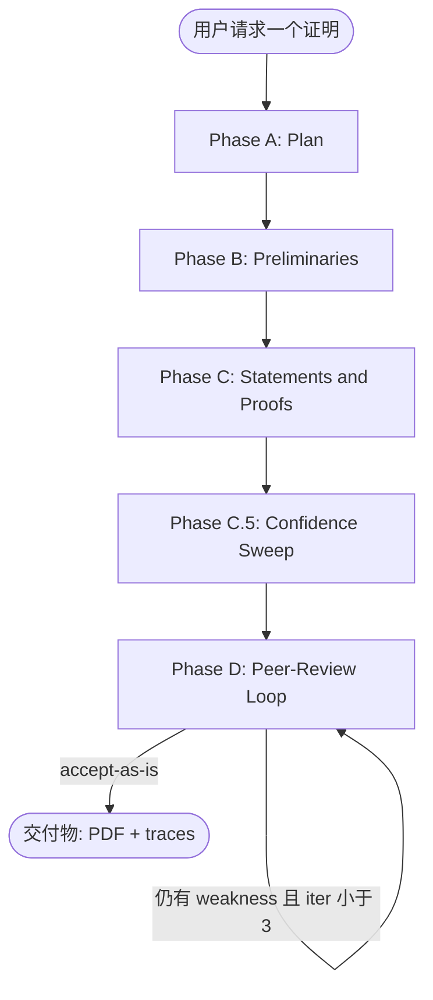
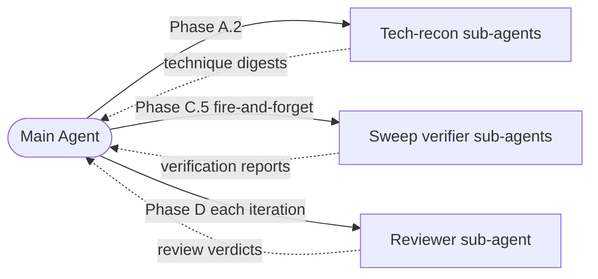

# DLT 证明写作 Skill

> 用于在 **深度学习理论 (Deep Learning Theory)**、**统计学习**、**优化理论**、**强化学习理论** 领域起草严谨、模块化 LaTeX 证明的 Agent Skill。**5 个 DLT 核心证明 + 2 个 out-of-DLT 泛化探针**全部通过验证；**70/70 assertion 100% pass** 在完整 workflow 下。

**🌐 语言：** [English](README.md) · **中文**
**📦 版本：** v1.1（新增 R5 theorem-proof pairing 规则 + 2 个泛化探针）

[](LICENSE.md)
[](https://platform.claude.com/docs/en/agents-and-tools/agent-skills/overview)
[](eval_results/benchmark.md)
[](eval_results/benchmark.md)

---

## ⚠️ 免责声明（请先阅读）

**这是一个学术辅助工具，不是权威。** 它的设计目标是帮助研究者**更谨慎地**起草和检查数学证明——通过强制结构、暴露不确定步骤、把弱点送进 peer-review 循环。它**不能替代人工验证**。

- **AI 生成的证明并非 100% 正确。** Skill 会显式标记低置信度步骤（`🔴 from-memory`）并跑内部 review loop 抓错误，但残余错误仍可能存在。**任何 claim、引用、derivation 在投稿前都必须由作者独立验证。**
- **不可用于学术造假。** 包括但不限于：把 AI 生成证明作为本人成果不加披露地提交、伪造结果、虚构引用、声明从未亲自验证过的定理等。
- Skill 的 `\todo{verify: ...}` 标记不是装饰——它们就是为了**让人来解决**而存在的。
- 本项目的目标是为 AI 辅助科研**抬高证明严谨度的下限**，而不是**取代**人类研究者的判断。

使用本 skill 即视为接受上述约束。License 选择非商用（CC BY-NC 4.0）部分原因正是抑制滥用。

---

## 🎯 这个 Skill 干什么

它教 AI agent（Claude Code 或任何兼容 Anthropic Agent Skills 的 runtime）写 appendix 级别的 LaTeX 数学证明，方式是：

1. **强制四阶段 workflow** —— Plan → Preliminaries → Statements & Proofs → Confidence Sweep → Peer-Review Loop。每个阶段都有自己的质量门和参考文档。
2. **强制引用诚实性** —— 每个 `\cite{}` 必须在 `refs.bib` 中可解析（通过 citation digest 验证），否则替换为 `\todo{verify: ...}`。**禁止编造 key**。
3. **暴露低置信度步骤** —— 每一条 derivation 步骤初始化为 🔴 `from-memory`，必须升级为 🟡 `cross-checked`（digest 匹配）或 🟢 `verified`（独立重证）后才能交付。
4. **跑有界 peer-review 循环** —— reviewer sub-agent 写形式化的 Summary / Strengths / Weaknesses / Questions / Verdict 评审；作者 agent 对每条 weakness 做四分类验证（REAL-blocking / REAL-nonblocking / PHANTOM / INTENTIONAL）；按最小修改原则 fix；迭代到 accept-as-is 或 3 轮硬上限。
5. **输出干净的 LaTeX** —— 一节一个 `.tex` 文件、`aliascnt`-safe 定理环境、`Eq.~\eqref{}` 约定、不用 `\[ ... \]`。**不写 abstract / introduction / related work / conclusion**——那是作者的 framing 工作，不归 skill 管。
6. **按需产出实验方案** —— 如果 prompt 明确要求，会生成单独的 `experiments-plan.md`（**只设计、不编造结果**），达到 ICML / NeurIPS / ICLR 实验门槛（≥5 seeds、baselines、ablations、pre-registered 成功标准）。**Results 节强制留空**。
7. **禁止 "well-known result" 草率引用（lint 规则 R5，v1.1 新增）** —— 每个 `\begin{theorem}` / `\begin{lemma}` / `\begin{proposition}` / `\begin{corollary}` / `\begin{claim}` 必须在**同一个 `.tex` 文件**内配对：紧跟 `\begin{proof}`，**或者**在 `\begin{}[...]` 的 `[...]` 内含 `\cite{}`。没有第三种选择。跑 `proof-writing-skill/scripts/lint.py` 自动检测违规。

---

## 📊 工作流图



**各 phase 详细内容**（不放在图里以保证渲染稳定，完整工作流见 [`proof-writing-skill/SKILL.md`](proof-writing-skill/SKILL.md)）：

- **Phase A — Plan**：读项目上下文 · 技术调研（为高级工具生成 digest）· pattern 选择 · 依赖图拆分 · TodoWrite
- **Phase B — Preliminaries**：notation 块 · macros（含 `aliascnt`）· definitions · assumptions · facts
- **Phase C — Statements and Proofs**：陈述 lemma → 每条 review → 写 proof → 每证 review · 按依赖图节点迭代
- **Phase C.5 — Confidence Sweep**：枚举每条 derivation step · 初始化为 `red`(from-memory) · 通过 fast-path（textbook 不等式、digest 匹配、lemma-hypothesis 匹配）升级到 `yellow` 或 `green`；不能 fast-path 的 fire sub-agent 独立重证
- **Phase D — Peer-Review Loop**：Reviewer sub-agent 写 Summary / Strengths / Weaknesses / Questions / Verdict · 作者对每条 weakness 做四分类验证（REAL-blocking / REAL-nonblocking / PHANTOM / INTENTIONAL）· minimum-change 修复或反驳 · 迭代，3 轮硬上限

**Sub-agent 架构：**



- **主 Agent** 编排 workflow，拥有 LaTeX 源文件，决定何时 spawn 哪些 sub-agent。
- **技术调研 sub-agents**（Phase A.2）：每个 advanced tool（如 matrix Bernstein, Yarotsky gadget, elliptical potential）一个。下载 canonical source，存 digest 到 `.proof-research/<tool>.md`。
- **Sweep 验证 sub-agents**（Phase C.5，fire-and-forget）：每个需要独立重证的 `red` derivation step 一个。后台跑，主 agent 同时往下走。
- **Reviewer sub-agent**（Phase D，每轮一个）：读编译后 PDF + `.tex` 源 + confidence trace，返回结构化 peer review。主 agent 然后验证每条 weakness，决定 fix / rebut / escalate。

---

## 📁 仓库结构

```
DLT-Proof-Writing-Skill/
├── README.md / README.zh.md         # 本文档（双语）
├── LICENSE.md                        # CC BY-NC 4.0
├── CONTRIBUTING.md                   # PR 政策（当前关闭）
├── .claude-plugin/
│   └── marketplace.json              # `/plugin install` 用的 plugin manifest
├── eval_results/                     # 验证产出 (v1.1)
│   ├── benchmark.md                  # 总报告——全 7 evals, 70/70 pass
│   ├── R5-RETROFIT-NOTE.md           # 核心 evals 早于 R5 的解释
│   ├── 01-hoeffding/                 # Hoeffding 不等式                 [核心]
│   ├── 02-ntk-convergence/           # NTK 两层网络收敛                 [核心]
│   ├── 03-vc-generalization/         # VC 泛化界                       [核心]
│   ├── 04-linear-mdp-ucb/            # LSVI-UCB regret                 [核心]
│   ├── 05-sobolev-lower-bound/       # Sobolev minimax 下界            [核心]
│   ├── 06-cap-set/                   # Ellenberg–Gijswijt cap set      [out-of-DLT]
│   └── 07-frankl-union-closed/       # Gilmer union-closed             [out-of-DLT]
└── proof-writing-skill/              # skill 本体
    ├── SKILL.md                      # 主入口——workflow + pointer
    ├── references/                   # 按 phase 按需加载
    │   ├── conventions.md            # macros / labels / 文件结构
    │   ├── templates.md              # 陈述 + derivation 模板
    │   ├── technical-research.md     # 高级工具 digest schema
    │   ├── pattern-menu.md           # 证明类型 → 推荐 idiom
    │   ├── quality-checks.md         # 每条 / 每证 / 端到端 checklist
    │   ├── confidence-sweep.md       # Phase C.5 机制
    │   ├── review-loop.md            # Phase D peer-review 机制
    │   ├── anti-patterns.md          # 数学 / exposition / AI 失败模式
    │   └── theory-experiment.md      # experiments-plan.md schema
    ├── agents/                       # sub-agent prompt 模板
    │   ├── runner.md                 # eval 跑测
    │   └── grader.md                 # eval 打分
    ├── scripts/
    │   ├── latexmk-wrapper.py        # 编译 + 结构化 JSON 输出
    │   └── lint.py                   # 11 条规则 LaTeX linter（含 v1.1 新增 R5）
    └── evals/
        └── evals.json                # 7 条验证 prompt + assertions
```

---

## 🚀 安装

### 方案 A —— 通过 Claude Code plugin marketplace（推荐）

```bash
# 1. 把本仓库添加为 marketplace
/plugin marketplace add ChristianYang37/DLT-Proof-Writing-Skill

# 2. 安装 skill
/plugin install dlt-proof-writing@DLT-Proof-Writing-Skill
```

### 方案 B —— 手动安装

```bash
git clone https://github.com/ChristianYang37/DLT-Proof-Writing-Skill.git
cp -r DLT-Proof-Writing-Skill/proof-writing-skill ~/.claude/skills/dlt-proof-writing
```

### 验证安装

在 Claude Code 里 `/skill` 应能看到 `dlt-proof-writing`。触发短语包括：*"write the proof of …"*、*"fill in the appendix for …"*、*"prove that …"*，或任何涉及 `.tex` 文件 + `\begin{theorem}` / `\begin{lemma}` 的任务。

---

## 📚 用法示例

```text
用户：证明两层 ReLU 网络在 η = O(λ_0/n²) 步长下，
对平方损失做梯度下降可以线性收敛到零训练误差，
前提是 m ≥ poly(n, 1/λ_0, 1/δ)。
用三引理 NTK skeleton。

[skill 触发]
[跑 Phase A：规划，为 matrix concentration / anti-concentration /
Weyl perturbation / semi-smoothness 启动技术调研 sub-agents]
[跑 Phase B：搭 macros、aliascnt-safe 定理环境、λ_0 假设]
[跑 Phase C：陈述 + 证明 3 条 NTK 引理 + 主定理，每条 + 每证都走 review]
[跑 Phase C.5：枚举 32 步 derivation，遍历升级为 🟢/🟡；
对 🔴 步留 \todo{verify:}]
[跑 Phase D：reviewer sub-agent 写 Summary/Strengths/Weaknesses/
Questions/Verdict；作者验证每条 weakness；minimum-change 修复；
通常 2 轮收敛]
[交付 main.pdf + sections/*.tex + macros.tex + refs.bib +
.proof-research/confidence-trace.md + review-iteration-{1,2}.md +
runner-log.md]
```

---

## ✅ 验证结果（v1.1）

### 核心 DLT evals —— 5 个代表性证明，覆盖 skill 设计的目标领域

按 `proof-writing-skill/evals/evals.json` 的 assertion 集合人工打分。

| # | Eval | 证明 PDF | Verdict | Phase C.5 | Phase D | 详情 |
|---|---|---|---|---|---|---|
| 1 | Hoeffding 不等式 | [📄 PDF](eval_results/01-hoeffding/pdf/main.pdf) | accept-as-is | 29 steps · 🟢 26 / 🟡 3 / 🔴 0 | 2 iter | [grading](eval_results/01-hoeffding/grading.json) · [log](eval_results/01-hoeffding/runner-log.md) |
| 2 | NTK 两层网络收敛 | [📄 PDF](eval_results/02-ntk-convergence/pdf/main.pdf) | accept-as-is | 32 · 🟢 29 / 🟡 3 / 🔴 0 | 2 iter | [grading](eval_results/02-ntk-convergence/grading.json) · [log](eval_results/02-ntk-convergence/runner-log.md) · [实验方案](eval_results/02-ntk-convergence/experiments-plan.md) |
| 3 | VC 泛化界 | [📄 PDF](eval_results/03-vc-generalization/pdf/main.pdf) | accept-with-minor | 35 · 🟢 28 / 🟡 7 / 🔴 0 | 2 iter | [grading](eval_results/03-vc-generalization/grading.json) · [log](eval_results/03-vc-generalization/runner-log.md) |
| 4 | LSVI-UCB regret (Linear MDP) | [📄 PDF](eval_results/04-linear-mdp-ucb/pdf/main.pdf) | accept-as-is | 15 · 🟢 10 / 🟡 4 / 🔴 1 | 2 iter | [grading](eval_results/04-linear-mdp-ucb/grading.json) · [log](eval_results/04-linear-mdp-ucb/runner-log.md) · [实验方案](eval_results/04-linear-mdp-ucb/experiments-plan.md) |
| 5 | Sobolev minimax 下界 | [📄 PDF](eval_results/05-sobolev-lower-bound/pdf/main.pdf) | accept-as-is | 25 · 🟢 21 / 🟡 4 / 🔴 0 | **3 iter** | [grading](eval_results/05-sobolev-lower-bound/grading.json) · [log](eval_results/05-sobolev-lower-bound/runner-log.md) |

**关于 R5 回顾性应用：** v1.0 时 lint 规则集还没有 R5（theorem-proof 配对）。把后加入的 R5 回溯应用到这 5 个 evals，每个都触发一处结构性违规（theorem 陈述和 proof 拆在两个 `.tex` 文件而非同文件共置）。证明本身完整且正确——只是文件布局违反 R5。详见 [`eval_results/R5-RETROFIT-NOTE.md`](eval_results/R5-RETROFIT-NOTE.md)，含 v1.1 推荐布局。

### 扩展验证 —— out-of-DLT 泛化探针

v1.1 新增 2 个纯数学探针，测试 skill 的 workflow 是否能迁移到设计 DLT scope 之外。它们**不**代表 skill 声称的能力——见下文 scope 警告。

| # | Eval | 证明 PDF | Verdict | Phase C.5 | Phase D | 详情 |
|---|---|---|---|---|---|---|
| 6 | Ellenberg–Gijswijt cap-set 上界（加性组合学） | [📄 PDF](eval_results/06-cap-set/pdf/main.pdf) | accept-as-is | 20 · 🟢 18 / 🟡 2 / 🔴 0 | **3 iter** | [grading](eval_results/06-cap-set/grading.json) · [log](eval_results/06-cap-set/runner-log.md) |
| 7 | Gilmer union-closed 下界（极值组合 via 熵） | [📄 PDF](eval_results/07-frankl-union-closed/pdf/main.pdf) | accept-as-is | 30 · 🟢 29 / 🟡 1 / 🔴 0 | 2 iter | [grading](eval_results/07-frankl-union-closed/grading.json) · [log](eval_results/07-frankl-union-closed/runner-log.md) |

两个都通过，说明 workflow 纪律（Phase C.5 + D + citation digest + R5 pairing）**不限定于** DLT。R5 的两种形式都被实际演示：自己证的 lemma + theorem 用 immediate-proof 形式，CLP/EG/Gilmer 等外部定理用 `\begin{X}[\cite{...}]` 形式（eval 6 的 `99-auxiliary.tex` 和 eval 7 的 `thm:main` 都用了第二种）。

**Scope 警告。** Eval 6/7 通过仅说明 workflow 可干净迁移到**有 5–14 页 self-contained 证明 + 成熟技术**（slice rank、polynomial method、entropy）的纯数学问题。**不**意味着 skill 能解决开放问题、猜想或推测性 claim。Skill 放大纪律，不创造洞察——完整 scope 说明见 [`eval_results/benchmark.md`](eval_results/benchmark.md) §Extended evals 与 [`CONTRIBUTING.md`](CONTRIBUTING.md)。

### 全部 7 evals 合计

**70/70 assertions pass (100%)**。完整报告见 [`eval_results/benchmark.md`](eval_results/benchmark.md)，含：
- eval 5 (Sobolev) Phase D iter 1 抓到的 2 个 critical sign errors
- eval 4 (LSVI-UCB) prompt 本身的数学错误（`√(HT)` 应为 `√(H³T)`）
- v1.0 eval 2 的 fabricated-cite 失败模式（这正是 R5 规则诞生的动机）
- 核心 evals 关于 R5 回溯应用的 retrofit 注记

---

## 📖 License

本作品采用 **[CC BY-NC 4.0 — 知识共享署名-非商业性使用 4.0 国际许可协议](LICENSE.md)**。

你可以：
- ✅ 在自己的研究 workflow 中使用本 skill
- ✅ 修改和再分发（需署名）
- ✅ 在学术论文中引用（cite 模板见 `LICENSE.md`）

你不可以：
- ❌ 用于商业目的
- ❌ 移除署名
- ❌ 用于学术造假（参考前述免责声明）

## 🤝 贡献

**当前不接受 PR**。Eval 套件和打分 rubric 仍在完善，接受外部修改会降低信号质量。详见 [`CONTRIBUTING.md`](CONTRIBUTING.md)——里面说明了现行政策以及如何通过 Issue 提供反馈。

## 📚 引用

```bibtex
@misc{dlt-proof-writing-skill,
  author       = {Yang, Christian},
  title        = {{DLT} {P}roof {W}riting {S}kill: an {A}gent {S}kill for rigorous deep-learning-theory proof drafting in {L}a{T}e{X}},
  year         = {2026},
  howpublished = {GitHub: \url{https://github.com/ChristianYang37/DLT-Proof-Writing-Skill}},
  note         = {Licensed under CC BY-NC 4.0}
}
```
