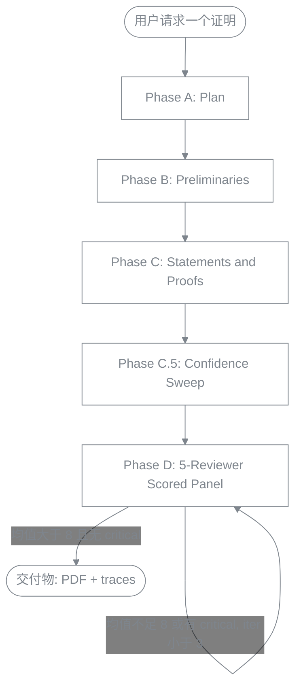
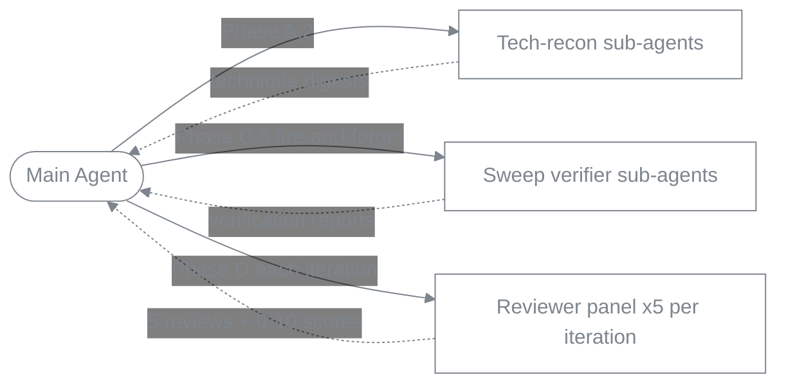

# DLT 证明写作 Skill

> 用于在 **深度学习理论 (Deep Learning Theory)**、**统计学习**、**优化理论**、**强化学习理论** 领域起草严谨、模块化 LaTeX 证明的 Agent Skill。**5 个 DLT 核心证明 + 2 个 out-of-DLT 泛化探针**全部通过验证；**70/70 assertion 100% pass** 在完整 workflow 下。

**🌐 语言：** [English](README.md) · **中文**
**📦 版本：** v1.2（苏格拉底式 intake · 公式化证明强制 R19 · 五评审打分小组）

[](LICENSE.md)
[](https://platform.claude.com/docs/en/agents-and-tools/agent-skills/overview)
[](eval_results/benchmark.md)
[](eval_results/benchmark.md)

---

## ⚠️ 免责声明（请先阅读）

**这是一个学术辅助工具，不是权威。** 它的设计目标是帮助研究者**更谨慎地**起草和检查数学证明——通过强制结构、暴露不确定步骤、把弱点送进 peer-review 循环。它**不能替代人工验证**。

- **AI 生成的证明并非 100% 正确。** Skill 会显式标记低置信度步骤（`🔴 from-memory`）并跑内部 review loop 抓错误，但残余错误仍可能存在。**任何 claim、引用、derivation 在投稿前都必须由作者独立验证。**
- **不可用于学术造假。** 包括但不限于：把 AI 生成证明作为本人成果不加披露地提交、伪造结果、虚构引用、声明从未亲自验证过的定理等。
- Skill 的 `\todo{verify: ...}` 标记不是装饰——它们就是为了**让人来解决**而存在的。
- 本项目的目标是为 AI 辅助科研**抬高证明严谨度的下限**，而不是**取代**人类研究者的判断。

使用本 skill 即视为接受上述约束。License 选择非商用（CC BY-NC 4.0）部分原因正是抑制滥用。

---

## 🎯 这个 Skill 干什么

它教 AI agent（Claude Code 或任何兼容 Anthropic Agent Skills 的 runtime）写 appendix 级别的 LaTeX 数学证明，方式是：

1. **强制四阶段 workflow** —— Plan（含**苏格拉底式 intake**：动笔前先**和你一起**敲定证明的 setting 与 architecture）→ Preliminaries → Statements & Proofs → Confidence Sweep → Peer-Review Loop。每个阶段都有自己的质量门和参考文档。
2. **强制引用诚实性** —— 每个 `\cite{}` 必须在 `refs.bib` 中可解析（通过 citation digest 验证），否则替换为 `\todo{verify: ...}`。**禁止编造 key**。
3. **暴露低置信度步骤** —— 每一条 derivation 步骤初始化为 🔴 `from-memory`，必须升级为 🟡 `cross-checked`（digest 匹配）或 🟢 `verified`（独立重证）后才能交付。
4. **跑有界的五评审打分小组** —— 每轮并行 spawn 五个独立 sub-agent（3 个正确性视角 + 1 个数学品味 reviewer + 1 个 derivation-integrity / 反 proof-hacking reviewer），各打 0–10 分；作者 agent 合并去重后对每条 weakness 做四分类验证（REAL-blocking / REAL-nonblocking / PHANTOM / INTENTIONAL），按最小修改原则 fix；**仅当 5 个分数均值 > 8 且无未解决的 critical 时才 accept**，否则迭代到收敛或 3 轮硬上限。
5. **输出干净的 LaTeX** —— 一节一个 `.tex` 文件、`aliascnt`-safe 定理环境、`Eq.~\eqref{}` 约定、不用 `\[ ... \]`。**不写 abstract / introduction / related work / conclusion**——那是作者的 framing 工作，不归 skill 管。
6. **按需产出实验方案** —— 如果 prompt 明确要求，会生成单独的 `experiments-plan.md`（**只设计、不编造结果**），达到 ICML / NeurIPS / ICLR 实验门槛（≥5 seeds、baselines、ablations、pre-registered 成功标准）。**Results 节强制留空**。
7. **禁止 "well-known result" 草率引用（lint 规则 R5，v1.1 新增）** —— 每个 `\begin{theorem}` / `\begin{lemma}` / `\begin{proposition}` / `\begin{corollary}` / `\begin{claim}` 必须在**同一个 `.tex` 文件**内配对：紧跟 `\begin{proof}`，**或者**在 `\begin{}[...]` 的 `[...]` 内含 `\cite{}`。没有第三种选择。跑 `proof-writing-skill/scripts/lint.py` 自动检测违规。

8. **强制公式化 derivation、反对语言推导（lint 规则 R19，v1.2 新增）** —— 证明必须用公式（display 块 + 行内公式）承载推导，文字只用来解释每一步**为什么**这样设。`lint.py` 按字符计算每个 proof 内的比例，**当自然语言文字多于公式时报 error**（对确实需要大量文字的组合学论证留 `% lint: ignore R19` 逃生通道）。这在确定性层面消灭"用文字推导"的失败模式；剩下的由 Phase D 的 derivation-integrity reviewer 兜底。

---

## 📊 工作流图



**各 phase 详细内容**（不放在图里以保证渲染稳定，完整工作流见 [`proof-writing-skill/SKILL.md`](proof-writing-skill/SKILL.md)）：

- **Phase A — Plan**：读项目上下文 · **苏格拉底式 intake（A.1a —— 和用户一起敲定 setting 与 architecture，阻塞式）** · 技术调研（为高级工具生成 digest）· pattern 选择 · 依赖图拆分 · TodoWrite
- **Phase B — Preliminaries**：notation 块 · macros（含 `aliascnt`）· definitions · assumptions · facts
- **Phase C — Statements and Proofs**：陈述 lemma → 每条 review → 写 proof → 每证 review · 按依赖图节点迭代
- **Phase C.5 — Confidence Sweep**：枚举每条 derivation step · 初始化为 `red`(from-memory) · 通过 fast-path（textbook 不等式、digest 匹配、lemma-hypothesis 匹配）升级到 `yellow` 或 `green`；不能 fast-path 的 fire sub-agent 独立重证
- **Phase D — 五评审打分小组**：每轮 5 个独立 reviewer（3 个正确性视角 + 数学品味 + derivation-integrity），各打 0–10 分 · 作者合并去重后对每条 weakness 做四分类验证（REAL-blocking / REAL-nonblocking / PHANTOM / INTENTIONAL）· minimum-change 修复或反驳 · **当且仅当均值 > 8 且无未解决 critical 时 accept** · 迭代，3 轮硬上限

**Sub-agent 架构：**



- **主 Agent** 编排 workflow，拥有 LaTeX 源文件，决定何时 spawn 哪些 sub-agent。
- **技术调研 sub-agents**（Phase A.2）：每个 advanced tool（如 matrix Bernstein, Yarotsky gadget, elliptical potential）一个。下载 canonical source，存 digest 到 `.proof-research/<tool>.md`。
- **Sweep 验证 sub-agents**（Phase C.5，fire-and-forget）：每个需要独立重证的 `red` derivation step 一个。后台跑，主 agent 同时往下走。
- **Reviewer 小组**（Phase D，**每轮 5 个，并行 spawn**）：3 个正确性视角 + 1 个数学品味 reviewer + 1 个 derivation-integrity / 反 proof-hacking reviewer。各自读编译后 PDF + `.tex` 源 + confidence trace，返回结构化 peer review 并打 0–10 分。主 agent 合并它们的 weakness、逐条验证，决定 fix / rebut / escalate；仅当均值 > 8 且无未解决 critical 时才 accept。

---

## 📁 仓库结构

```
DLT-Proof-Writing-Skill/
├── README.md / README.zh.md         # 本文档（双语）
├── LICENSE.md                        # CC BY-NC 4.0
├── CONTRIBUTING.md                   # PR 政策（当前关闭）
├── .claude-plugin/
│   └── marketplace.json              # `/plugin install` 用的 plugin manifest
├── eval_results/                     # 验证产出 (v1.1)
│   ├── benchmark.md                  # 总报告——全 7 evals, 70/70 pass
│   ├── R5-RETROFIT-NOTE.md           # 核心 evals 早于 R5 的解释
│   ├── 01-hoeffding/                 # Hoeffding 不等式                 [核心]
│   ├── 02-ntk-convergence/           # NTK 两层网络收敛                 [核心]
│   ├── 03-vc-generalization/         # VC 泛化界                       [核心]
│   ├── 04-linear-mdp-ucb/            # LSVI-UCB regret                 [核心]
│   ├── 05-sobolev-lower-bound/       # Sobolev minimax 下界            [核心]
│   ├── 06-cap-set/                   # Ellenberg–Gijswijt cap set      [out-of-DLT]
│   ├── 07-frankl-union-closed/       # Gilmer union-closed             [out-of-DLT]
│   └── 08-reasoning-as-optimization/ # thinking LLM 的 test-time scaling [blog demo]
└── proof-writing-skill/              # skill 本体
    ├── SKILL.md                      # 主入口——workflow + pointer
    ├── references/                   # 按 phase 按需加载
    │   ├── conventions.md            # macros / labels / 文件结构
    │   ├── socratic-intake.md        # Phase A.1a —— 和用户敲定 setting+architecture
    │   ├── templates.md              # 陈述 + derivation 模板（display-first）
    │   ├── technical-research.md     # 高级工具 digest schema
    │   ├── pattern-menu.md           # 证明类型 → 推荐 idiom
    │   ├── quality-checks.md         # 每条 / 每证 / 端到端 checklist
    │   ├── confidence-sweep.md       # Phase C.5 机制
    │   ├── review-loop.md            # Phase D 五评审小组编排
    │   ├── reviewer-roles.md         # 5 个 reviewer 角色 prompt + 0-10 评分标尺
    │   ├── anti-patterns.md          # 数学 / exposition / AI 失败模式
    │   └── theory-experiment.md      # experiments-plan.md schema
    ├── agents/                       # sub-agent prompt 模板
    │   ├── runner.md                 # eval 跑测
    │   └── grader.md                 # eval 打分
    ├── scripts/
    │   ├── latexmk-wrapper.py        # 编译 + 结构化 JSON 输出（Phase D gate (a)）
    │   ├── lint.py                   # 静态 lint 规则 R0a–R19（Phase D gate (b)）
    │   ├── check_confidence_tags.py  # confidence-sweep 覆盖率（Phase D gate (c)）
    │   ├── check_scope.py            # 校验 .proof-research/scope.md（Phase A.0a）
    │   └── hook_output_guard.py      # PreToolUse hook —— 阻止编译产物写到 .output/ 之外
    ├── settings.recommended.json     # 复制到项目 .claude/settings.json 启用上面的 hook
    └── evals/
        └── evals.json                # 7 条验证 prompt + assertions
```

---

## 🚀 安装

### 方案 A —— 通过 Claude Code plugin marketplace（推荐）

```bash
# 1. 把本仓库添加为 marketplace
/plugin marketplace add ChristianYang37/DLT-Proof-Writing-Skill

# 2. 安装 skill
/plugin install dlt-proof-writing@DLT-Proof-Writing-Skill
```

### 方案 B —— 手动安装

```bash
git clone https://github.com/ChristianYang37/DLT-Proof-Writing-Skill.git
cp -r DLT-Proof-Writing-Skill/proof-writing-skill ~/.claude/skills/dlt-proof-writing
```

### 验证安装

在 Claude Code 里 `/skill` 应能看到 `dlt-proof-writing`。触发短语包括：*"write the proof of …"*、*"fill in the appendix for …"*、*"prove that …"*，或任何涉及 `.tex` 文件 + `\begin{theorem}` / `\begin{lemma}` 的任务。

---

## 📚 用法示例

```text
用户：证明两层 ReLU 网络在 η = O(λ_0/n²) 步长下，
对平方损失做梯度下降可以线性收敛到零训练误差，
前提是 m ≥ poly(n, 1/λ_0, 1/δ)。
用三引理 NTK skeleton。

[skill 触发]
[跑 Phase A.1a 苏格拉底式 intake：和用户确认 norm / regime / 紧常数还是 poly-slack，
等用户回答后再动笔]
[跑 Phase A：规划，为 matrix concentration / anti-concentration /
Weyl perturbation / semi-smoothness 启动技术调研 sub-agents]
[跑 Phase B：搭 macros、aliascnt-safe 定理环境、λ_0 假设]
[跑 Phase C：陈述 + 证明 3 条 NTK 引理 + 主定理，每条 + 每证都走 review]
[跑 Phase C.5：枚举 32 步 derivation，遍历升级为 🟢/🟡；
对 🔴 步留 \todo{verify:}]
[跑 Phase D：五评审小组（3 正确性 + 品味 + derivation-integrity）各打 0–10 分；
作者合并并验证每条 weakness；minimum-change 修复；
均值 > 8 且无 critical 时 accept —— 通常 2 轮收敛]
[交付 main.pdf + sections/*.tex + macros.tex + refs.bib +
.proof-research/confidence-trace.md + review-iteration-{1,2}.md +
runner-log.md]
```

---

## 🧩 可复用 Prompt 模版

一个可即用的 XML 标签式证明任务模版。**只有 `<problem>` 是必填**——其它槽位都可留白；留白时 agent 必须在 Phase A 给出具体提案给你确认，才能开始草拟证明。`<skill_invocation>` 和 `<blank_handling_protocol>` 两段把 agent 绑定到完整 skill workflow 上，并禁止"静默填空"。

设计要点：Anthropic 训练的 Claude 对 XML 标签段落识别比纯文本一致性高 20–40%；占位符用两种视觉区分（`[[ FILL IN — REQUIRED ]]` vs. `[[ leave blank to delegate ]]`），避免 agent 模仿格式而不做实事。

```markdown
<skill_invocation>
Invoke the `dlt-proof-writing` skill and follow its workflow in full:
Phase A (Plan) → Phase B (Preliminaries) → Phase C (Statements & Proofs)
→ Phase C.5 (Confidence Sweep) → Phase D (End-to-End Review).

Treat the three non-negotiables in SKILL.md as binding:
(1) all compile artifacts under `<project-root>/.output/`;
(2) Phase-D gates (a) latexmk-wrapper, (b) lint.py, (c) check_confidence_tags.py
    MUST all exit 0 before the review loop;
(3) every `\cite{key}` and every non-trivial technique has a `.proof-research/` digest.

Do NOT shortcut any phase based on apparent simplicity — let `check_scope.py` decide.
The honesty protocol governs every step: if any of the objective triggers in
SKILL.md §Honesty protocol fires, write `\todo{verify: ...}` AND surface to me.
</skill_invocation>

<problem>
<!-- REQUIRED. The formal setting and statement to be proved.
     Be explicit about: norm, probability space, asymptotic regime,
     whether constants must be tight or `\poly`-slack is acceptable,
     what counts as a "win" (equality / inequality / high-prob / rate). -->
[[ FILL IN — REQUIRED ]]
</problem>

<approach>
<!-- OPTIONAL. Your intuition / strategic plan. Examples:
     "reduce to matrix Bernstein after a chaining argument",
     "two-stage: optimization landscape lemma then SGD escape time".
     If left blank, the agent MUST derive an approach in Phase A.3
     (pattern selection from references/pattern-menu.md) and surface
     it for my approval BEFORE drafting any proof body. -->
[[ leave blank to delegate ]]
</approach>

<proof_structure>
<!-- OPTIONAL. The dependency graph you envision: which lemmas, what each
     does, in what order. If left blank, the agent MUST produce the
     decomposition in Phase A.4–A.5, write `.proof-research/dependency-graph.md`,
     and surface the graph for my approval before any statement is drafted.
     Apply Occam's razor: every lemma must have non-empty Downstream consumers. -->
[[ leave blank to delegate ]]
</proof_structure>

<target_theorems>
<!-- OPTIONAL. The final theorem(s) you want produced, with desired
     tightness / rate / probability level. Example:
     "Theorem 1 (main): with prob >= 1-delta, ||theta_T - theta*||_2 <= C*d*sqrt(log(1/delta)/T)".
     If left blank, the agent infers from <problem>, proposes a two-tier
     informal/formal statement, and gets my approval before drafting the proof. -->
[[ leave blank to delegate ]]
</target_theorems>

<context>
<!-- OPTIONAL but high-leverage. If blank, agent does Phase A.0 reconnaissance
     and reports findings before declaring Phase A complete. -->
- Project root:
- refs.bib path:
- macros file (e.g. math_macros.tex):
- Existing chapters this proof must compose with:
- Citation key style (e.g. authoryear / lastname-first-letters):
</context>

<constraints>
<!-- OPTIONAL. Hard constraints beyond skill defaults:
     - pre-approved citations vs. ones the agent must research from scratch
     - constants tightness target
     - off-limits reductions (e.g. "do NOT reduce to ETH")
     - which conventions to inherit from existing project files
     NOTE: scope CANNOT be lowered to skip Phase C.5/D — `check_scope.py` enforces this. -->
[[ leave blank for skill defaults ]]
</constraints>

<blank_handling_protocol>
For every section above I left as `[[ leave blank to delegate ]]`:
1. Do NOT silently fill it in and proceed.
2. During Phase A, produce a concrete proposal for that section.
3. Surface ALL proposals together as a single numbered decision list to me
   BEFORE drafting any preliminaries or proof body.
4. If I do not respond within one turn, choose the most conservative option,
   record it in `.proof-research/decisions.md` (NOT as an inline `\todo` in the
   `.tex`), and continue. Re-surface it in the Phase D final report.
5. Never treat a blank as license to silently choose the easier path
   (e.g. a weaker target theorem). The conservative default is the
   STRONGER / TIGHTER option, not the more convenient one.
</blank_handling_protocol>

<output_expectations>
Final message MUST include:
1. The verbatim Final-completion checklist from SKILL.md, with each `[ ]`
   replaced by `[✅]` / `[❌]` + one-line evidence (file:line, command output,
   `n/a — reason`, or `\todo{}` location).
2. A summary: what was proved, decomposition used, patterns applied,
   residual `\todo{}` items needing my judgment.
3. If any `<blank_handling_protocol>` proposals were made, restate
   which option was finally adopted for each.
A bare "all done" is not an acceptable completion message.
</output_expectations>
```

---

## ✅ 验证结果（v1.2 跑测）

> **关于这批跑测。** 下方 eval 1–7 由一条多 agent 流水线（以 Workflow 编排）在 **v1.2 下端到端重跑**：每个 eval 先由一个 author subagent 跑 Phase A–C.5，然后**五个真正独立的 reviewer subagent** 每轮各打 0–10 分（循环至均值 > 8 且无未解决 critical），最后由一个独立 grader subagent 按固定的 `evals.json` assertion 打分。每个证明都通过全部三道 Phase-D gate（lint **0 error 含 R19**、`compile_ok` 且无 overfull、置信度标签覆盖）。**70/70 assertion 通过。** 因为评审小组是*独立的*（不是同一个 agent 自评自改），均值**随难度区分**：干净的教科书证明一轮即过 9.0，而难的 NTK 证明从 **4.2** 起步、经三轮真实修复才到 8.2。R19 只在预期处触发（公式密集证明干净通过；确实需要文字的子证明带显式 `% lint: ignore R19`）。Eval 8（blog 配套）维持其早先的单评审结果不变。

### 核心 DLT evals

5 个用 assertion 集合人工打分的 calibration 证明（eval 1–5），加上配套 blog post（test-time scaling）的 worked-example 证明（eval 8）。打分使用 `proof-writing-skill/evals/evals.json` 里的 assertion；eval 8 没有固定的 assertion 集合，由 Phase D gate 通过 + review-loop 收敛判定，所以不计入下面的 70/70。

| # | Eval | 证明 PDF | Verdict（小组均值） | Phase C.5 | Phase D | 详情 |
|---|---|---|---|---|---|---|
| 1 | Hoeffding 不等式 | [📄 PDF](eval_results/01-hoeffding/pdf/main.pdf) | accepted · **9.0**/10 | 15 steps · 🟢 13 / 🟡 2 / 🔴 0 | 1 iter | [grading 9/9](eval_results/01-hoeffding/grading.json) · [log](eval_results/01-hoeffding/runner-log.md) |
| 2 | NTK 两层网络收敛 | [📄 PDF](eval_results/02-ntk-convergence/pdf/main.pdf) | accepted · **8.2**/10 | 33 · 🟢 25 / 🟡 8 / 🔴 0 | **3 iter** | [grading 12/12](eval_results/02-ntk-convergence/grading.json) · [log](eval_results/02-ntk-convergence/runner-log.md) · [实验方案](eval_results/02-ntk-convergence/experiments-plan.md) |
| 3 | VC 泛化界 | [📄 PDF](eval_results/03-vc-generalization/pdf/main.pdf) | accepted · **8.8**/10 | 22 · 🟢 17 / 🟡 5 / 🔴 0 | **3 iter** | [grading 8/8](eval_results/03-vc-generalization/grading.json) · [log](eval_results/03-vc-generalization/runner-log.md) |
| 4 | LSVI-UCB regret (Linear MDP) | [📄 PDF](eval_results/04-linear-mdp-ucb/pdf/main.pdf) | accepted · **8.4**/10 | 50 · 🟢 32 / 🟡 17 / 🔴 1 | 2 iter | [grading 12/12](eval_results/04-linear-mdp-ucb/grading.json) · [log](eval_results/04-linear-mdp-ucb/runner-log.md) · [实验方案](eval_results/04-linear-mdp-ucb/experiments-plan.md) |
| 5 | Sobolev minimax 下界 | [📄 PDF](eval_results/05-sobolev-lower-bound/pdf/main.pdf) | accepted · **8.4**/10 | 27 · 🟢 23 / 🟡 4 / 🔴 0 | 2 iter | [grading 9/9](eval_results/05-sobolev-lower-bound/grading.json) · [log](eval_results/05-sobolev-lower-bound/runner-log.md) |
| 8 | Reasoning as Optimization（test-time scaling） | [📄 PDF](eval_results/08-reasoning-as-optimization/pdf/main.pdf) | accept-with-minor *(v1.1)* | 52 · 🟢 40 / 🟡 14 / 🔴 0 resolved | **4 iter** | [eval 源码](eval_results/08-reasoning-as-optimization/) |

**关于 R5：** 与最初的 v1.0 跑测（把每个 theorem 与其 proof 拆在两个文件）不同，v1.2 重跑**把每个 theorem 与 proof 共置于同一个 `.tex` 文件**，因此七个 eval 现在都 **R5 干净**（lint 的 R5 0 违规）。历史回溯说明保留在 [`eval_results/R5-RETROFIT-NOTE.md`](eval_results/R5-RETROFIT-NOTE.md)。

### 扩展验证 —— out-of-DLT 泛化探针

v1.1 新增 2 个纯数学探针，测试 skill 的 workflow 是否能迁移到设计 DLT scope 之外。它们**不**代表 skill 声称的能力——见下文 scope 警告。

| # | Eval | 证明 PDF | Verdict（小组均值） | Phase C.5 | Phase D | 详情 |
|---|---|---|---|---|---|---|
| 6 | Ellenberg–Gijswijt cap-set 上界（加性组合学） | [📄 PDF](eval_results/06-cap-set/pdf/main.pdf) | accepted · **8.8**/10 | 20 · 🟢 17 / 🟡 3 / 🔴 0 | 1 iter | [grading 10/10](eval_results/06-cap-set/grading.json) · [log](eval_results/06-cap-set/runner-log.md) |
| 7 | Gilmer union-closed 下界（极值组合 via 熵） | [📄 PDF](eval_results/07-frankl-union-closed/pdf/main.pdf) | accepted · **8.2**/10 | 31 · 🟢 25 / 🟡 6 / 🔴 0 | 1 iter | [grading 10/10](eval_results/07-frankl-union-closed/grading.json) · [log](eval_results/07-frankl-union-closed/runner-log.md) |

两个都通过，说明 workflow 纪律（Phase C.5 + D + citation digest + R5 pairing）**不限定于** DLT。R5 的两种形式都被实际演示：自己证的 lemma + theorem 用 immediate-proof 形式，CLP/EG/Gilmer 等外部定理用 `\begin{X}[\cite{...}]` 形式（eval 6 的 `99-auxiliary.tex` 和 eval 7 的 `thm:main` 都用了第二种）。

**Scope 警告。** Eval 6/7 通过仅说明 workflow 可干净迁移到**有 5–14 页 self-contained 证明 + 成熟技术**（slice rank、polynomial method、entropy）的纯数学问题。**不**意味着 skill 能解决开放问题、猜想或推测性 claim。Skill 放大纪律，不创造洞察——完整 scope 说明见 [`eval_results/benchmark.md`](eval_results/benchmark.md) §Extended evals 与 [`CONTRIBUTING.md`](CONTRIBUTING.md)。

### Calibration evals 1–7 合计

**70/70 assertions pass (100%)** —— 在 v1.2 的「五评审均值 > 8」门槛下，每个 eval 在 **1–3 轮小组迭代**内 accept（各 `.proof-research/review-iteration-*.md` 记录了全部五个 0–10 分及均值）。真正独立评审小组跑测要点：
- **评审小组随难度区分。** NTK 证明（eval 2）从均值 **4.2** 起步、经**三轮**真实修复才到 8.2；VC 证明（eval 3）从 7.4 起步、跑了三轮；干净的 Hoeffding 与组合学证明一轮即过。早先的自评小组把*所有*证明都打到 ~9.0 —— 独立性才让分数有意义。
- **prompt 错误被 surface 而非掩盖。** eval 4 证明正确的 `√(H³T)` LSVI-UCB 速率，而非 prompt 里不可证的 `√(HT)`，并把差异记为 `user-decision`；eval 5 诚实标注其「对所有 `n`」的 headline 仅在其构造所需的规则网格子序列上成立。
- **R19 在实践中生效：** 公式密集证明用 display math 承载推导；仅确实需要文字的子证明（eval 3 Sauer–Shelah ×1、eval 6 ×2）用 `% lint: ignore R19` 逃生通道。
- **诚实性保持：** 每个 `\cite` 都有 digest（0 编造），anti-pattern 扫描干净，残余 `\todo{verify}` 透明标注（eval 2 的 `1/8` 常数、eval 4 的 `C_β` 及其一个 🔴 步骤）。

---

## 📖 License

本作品采用 **[CC BY-NC 4.0 — 知识共享署名-非商业性使用 4.0 国际许可协议](LICENSE.md)**。

你可以：
- ✅ 在自己的研究 workflow 中使用本 skill
- ✅ 修改和再分发（需署名）
- ✅ 在学术论文中引用（cite 模板见 `LICENSE.md`）

你不可以：
- ❌ 用于商业目的
- ❌ 移除署名
- ❌ 用于学术造假（参考前述免责声明）

## 🤝 贡献

**当前不接受 PR**。Eval 套件和打分 rubric 仍在完善，接受外部修改会降低信号质量。详见 [`CONTRIBUTING.md`](CONTRIBUTING.md)——里面说明了现行政策以及如何通过 Issue 提供反馈。

## 📚 引用

```bibtex
@misc{dlt-proof-writing-skill,
  author       = {Yang, Chiwun},
  title        = {{DLT} {P}roof {W}riting {S}kill: an {A}gent {S}kill for rigorous deep-learning-theory proof drafting in {L}a{T}e{X}},
  year         = {2026},
  howpublished = {GitHub: \url{https://github.com/ChristianYang37/DLT-Proof-Writing-Skill}},
  note         = {Licensed under CC BY-NC 4.0}
}
```
